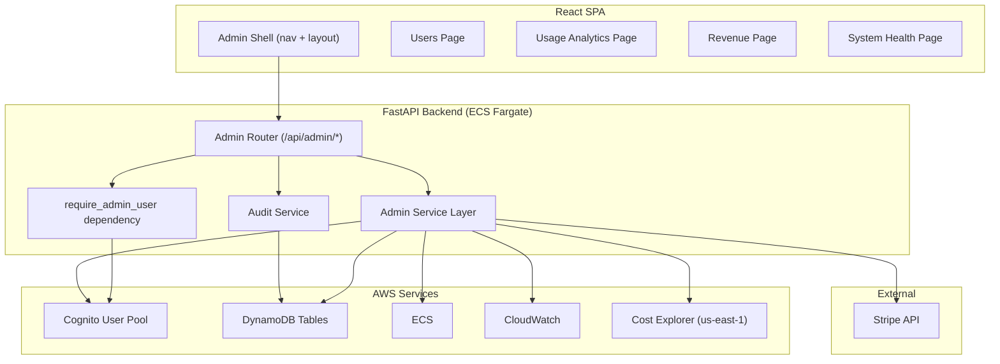
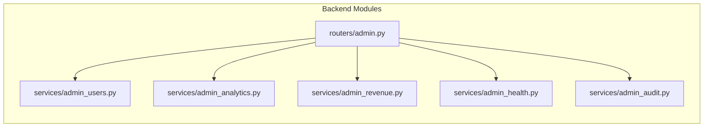
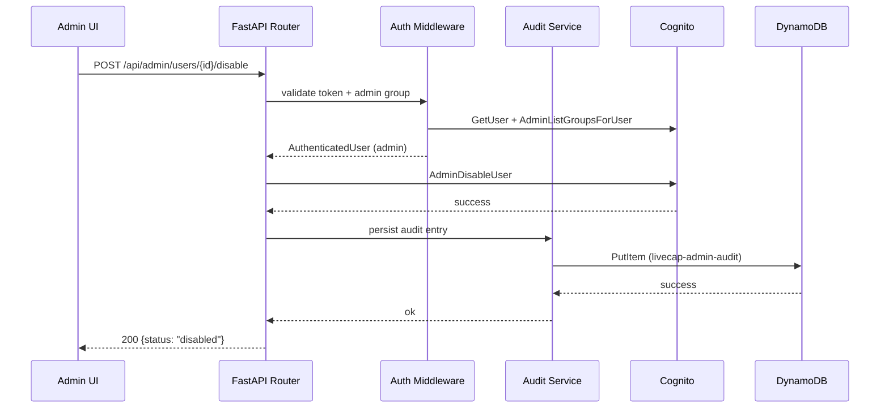

# Design Document: Admin Panel

## Overview

The Admin Panel extends LiveCap's existing read-only `GET /api/admin/overview` endpoint into a full-featured multi-page administrative experience. It adds mutating user actions (disable/enable, reset password, change tier), audit logging, usage analytics, revenue dashboards, and system health monitoring — all protected by Cognito "admin" group authorization.

### Key Design Decisions

1. **Server-side pagination and filtering** — The user list is paginated and filtered on the backend to avoid loading all Cognito users into memory at once. DynamoDB Scan is acceptable for the usage table given expected scale (<10K users), but Cognito ListUsers pagination is leveraged natively.

2. **Audit-first mutations** — Every mutating action writes an audit log entry *before* returning success. If the audit write fails, the mutation is rejected. This ensures no un-audited state changes occur.

3. **Graceful degradation** — Each AWS service call (Cognito, DynamoDB, Stripe, ECS, CloudWatch, Cost Explorer) fails independently. The API returns partial data with warnings rather than a blanket 500.

4. **SPA routing with code splitting** — The frontend uses path-based routing (`/admin/*`) with lazy-loaded sub-pages for each admin section to keep the initial bundle small.

5. **Stripe as source of truth for revenue** — MRR is calculated by querying Stripe's Subscriptions API directly rather than deriving from DynamoDB tier counts, so coupons and prorations are accurately reflected.

## Architecture

### High-Level Architecture



### Low-Level Component Architecture



### Request Flow for Mutating Actions



## Components and Interfaces

### Backend API Endpoints

#### User Management

| Method | Path | Description |
|--------|------|-------------|
| GET | `/api/admin/users` | Paginated user list with search/filter |
| GET | `/api/admin/users/{cognito_username}` | User detail (profile + usage + history) |
| POST | `/api/admin/users/{cognito_username}/disable` | Disable user account |
| POST | `/api/admin/users/{cognito_username}/enable` | Enable user account |
| POST | `/api/admin/users/{cognito_username}/reset-password` | Trigger password reset |
| POST | `/api/admin/users/{cognito_username}/change-tier` | Change subscription tier |

#### Analytics & Revenue

| Method | Path | Description |
|--------|------|-------------|
| GET | `/api/admin/usage` | Monthly aggregated usage data |
| GET | `/api/admin/usage/top-users` | Top 10 users by minutes |
| GET | `/api/admin/revenue` | MRR, subscriptions, transactions |

#### System Health

| Method | Path | Description |
|--------|------|-------------|
| GET | `/api/admin/system` | ECS status, CloudWatch alarms, cost estimate |

#### Legacy (preserved)

| Method | Path | Description |
|--------|------|-------------|
| GET | `/api/admin/overview` | Existing v1 read-only overview (unchanged) |

### Backend Service Modules

#### `services/admin_users.py`

Handles user CRUD operations against Cognito and DynamoDB.

```python
# Key functions
def list_users(
    page: int = 1,
    page_size: int = 20,
    search_email: str | None = None,
    filter_tier: str | None = None,
    filter_status: str | None = None,
) -> PaginatedUserList: ...

def get_user_detail(cognito_username: str) -> UserDetail: ...

def disable_user(cognito_username: str) -> UserActionResult: ...

def enable_user(cognito_username: str) -> UserActionResult: ...

def reset_password(cognito_username: str) -> UserActionResult: ...

def change_tier(cognito_username: str, new_tier: str) -> TierChangeResult: ...
```

#### `services/admin_audit.py`

Persists audit log entries for all mutating admin actions.

```python
def record_action(
    admin_user_id: str,
    target_user_id: str,
    action_type: str,  # "disable" | "enable" | "reset_password" | "change_tier"
    previous_value: str | None = None,
    new_value: str | None = None,
) -> AuditLogEntry: ...

def get_audit_entries_for_user(
    target_user_id: str,
    limit: int = 20,
) -> list[AuditLogEntry]: ...
```

#### `services/admin_analytics.py`

Aggregates usage data from the DynamoDB usage table.

```python
def get_monthly_usage(
    start_month: str | None = None,  # "YYYY-MM"
    end_month: str | None = None,
) -> MonthlyUsageData: ...

def get_top_users(month: str | None = None, limit: int = 10) -> list[TopUserRow]: ...

def get_tier_distribution() -> TierDistribution: ...
```

#### `services/admin_revenue.py`

Queries Stripe API for revenue metrics.

```python
def get_revenue_metrics() -> RevenueMetrics: ...

def get_recent_transactions(limit: int = 20) -> list[StripeTransaction]: ...
```

#### `services/admin_health.py`

Queries ECS, CloudWatch, and Cost Explorer for system health data.

```python
def get_system_health() -> SystemHealth: ...
```

### Frontend Components

#### Page Components

| Component | Route | Description |
|-----------|-------|-------------|
| `AdminShell` | `/admin/*` | Layout wrapper with sidebar nav |
| `AdminUsersPage` | `/admin/users` | User list + search + filters |
| `AdminUserDetailPanel` | `/admin/users/:id` | User detail slide-over or sub-page |
| `AdminUsagePage` | `/admin/usage` | Usage analytics + charts |
| `AdminRevenuePage` | `/admin/revenue` | Revenue metrics + transactions |
| `AdminSystemPage` | `/admin/system` | System health indicators |

#### Shared Components

| Component | Description |
|-----------|-------------|
| `AdminNav` | Sidebar/tab navigation with active state |
| `StatsCard` | Reusable stat display card (icon, label, value, sub-text) |
| `DataTable` | Reusable paginated table with sorting |
| `FilterBar` | Search input + dropdown filters |
| `ConfirmDialog` | Modal for confirming destructive actions |
| `AdminNotification` | Toast-style success/error notifications |

### Frontend Service Layer

#### `services/adminService.ts` (extended)

```typescript
// Existing
export async function getAdminOverview(): Promise<AdminOverview>;

// New user management
export async function getUsers(params: UserListParams): Promise<PaginatedUsers>;
export async function getUserDetail(username: string): Promise<UserDetail>;
export async function disableUser(username: string): Promise<ActionResult>;
export async function enableUser(username: string): Promise<ActionResult>;
export async function resetPassword(username: string): Promise<ActionResult>;
export async function changeTier(username: string, tier: string): Promise<TierChangeResult>;

// Analytics
export async function getUsageAnalytics(params?: DateRangeParams): Promise<UsageAnalytics>;
export async function getTopUsers(): Promise<TopUser[]>;

// Revenue
export async function getRevenue(): Promise<RevenueData>;

// System
export async function getSystemHealth(): Promise<SystemHealth>;
```

## Data Models

### Backend Response Models (Pydantic)

#### User List

```python
class UserRecord(BaseModel):
    cognito_username: str
    email: str
    tier: str  # "free" | "pro" | "business"
    status: str  # "enabled" | "disabled"
    identity_provider: str  # "native" | "Google" | etc.
    created_date: str  # ISO 8601
    last_active: str | None  # ISO 8601 or None
    sessions_used: int
    minutes_used: int
    subscription_status: str | None

class PaginatedUserList(BaseModel):
    users: list[UserRecord]
    page: int
    page_size: int
    total_pages: int
    total_users: int
    stats: UserStats

class UserStats(BaseModel):
    total_users: int
    free_count: int
    pro_count: int
    business_count: int
```

#### User Detail

```python
class UserDetail(BaseModel):
    profile: UserRecord
    usage_history: list[MonthlyUsage]  # last 3 months
    transcript_sessions: list[TranscriptSessionSummary]
    audit_log: list[AuditLogEntry]
    has_stripe_subscription: bool

class MonthlyUsage(BaseModel):
    month: str  # "YYYY-MM"
    sessions_used: int
    minutes_used: int

class TranscriptSessionSummary(BaseModel):
    session_id: str
    created_at: str  # ISO 8601
    segment_count: int
    duration_seconds: int | None
```

#### Audit Log

```python
class AuditLogEntry(BaseModel):
    entry_id: str  # UUID
    admin_user_id: str
    target_user_id: str
    action_type: str  # "disable" | "enable" | "reset_password" | "change_tier"
    previous_value: str | None
    new_value: str | None
    timestamp: str  # ISO 8601 UTC
```

#### Usage Analytics

```python
class MonthlyUsageData(BaseModel):
    months: list[MonthSummary]
    totals: UsageTotals

class MonthSummary(BaseModel):
    month: str  # "YYYY-MM"
    total_sessions: int
    total_minutes: int
    unique_active_users: int

class UsageTotals(BaseModel):
    total_sessions: int
    total_minutes: int
    unique_active_users: int

class TopUserRow(BaseModel):
    email: str
    tier: str
    sessions_used: int
    minutes_used: int

class TierDistribution(BaseModel):
    free: TierStats
    pro: TierStats
    business: TierStats

class TierStats(BaseModel):
    count: int
    percentage: float
```

#### Revenue

```python
class RevenueMetrics(BaseModel):
    mrr_usd: float
    active_subscriptions: int
    churned_subscriptions: int
    recent_transactions: list[StripeTransaction]
    stripe_data_available: bool
    warning: str | None  # Set if Stripe API unreachable

class StripeTransaction(BaseModel):
    date: str  # ISO 8601
    user_email: str | None
    amount_cents: int
    currency: str
    transaction_type: str  # "payment" | "refund" | "subscription_change"
```

#### System Health

```python
class SystemHealth(BaseModel):
    ecs: EcsStatus
    alarms: list[CloudWatchAlarm]
    cost_estimate: CostEstimate | None
    warnings: list[str]  # Services that failed to respond

class EcsStatus(BaseModel):
    running_count: int
    desired_count: int
    pending_count: int
    health_status: str  # "healthy" | "degraded" | "unreachable"

class CloudWatchAlarm(BaseModel):
    alarm_name: str
    state: str  # "OK" | "ALARM" | "INSUFFICIENT_DATA"
    reason: str | None

class CostEstimate(BaseModel):
    current_month_usd: float
    data_timestamp: str  # ISO 8601 — when AWS last updated this figure
```

### DynamoDB Table Schemas

#### `livecap-admin-audit` (new table)

| Attribute | Type | Key | Description |
|-----------|------|-----|-------------|
| pk | String | Partition Key | `TARGET#{cognito_username}` |
| sk | String | Sort Key | `TS#{ISO-8601-timestamp}#{uuid-short}` |
| entry_id | String | — | UUID for the entry |
| admin_user_id | String | — | Admin who performed the action |
| action_type | String | — | `disable`, `enable`, `reset_password`, `change_tier` |
| previous_value | String | — | Value before the change (nullable) |
| new_value | String | — | Value after the change (nullable) |
| ttl | Number | — | Epoch seconds, 365 days from creation |

**GSI: `admin-index`** — For querying all actions by a specific admin.
- Partition Key: `admin_user_id`
- Sort Key: `sk` (same timestamp-based sort key)

#### Existing Tables (no schema changes)

- **`livecap-usage-dev`** — Read for tier, sessions_used, minutes_used per user.
- **`livecap-transcript-history-dev`** — Read for per-user transcript session list.

### Frontend TypeScript Interfaces

```typescript
interface UserRecord {
  cognito_username: string;
  email: string;
  tier: 'free' | 'pro' | 'business';
  status: 'enabled' | 'disabled';
  identity_provider: string;
  created_date: string;
  last_active: string | null;
  sessions_used: number;
  minutes_used: number;
  subscription_status: string | null;
}

interface PaginatedUsers {
  users: UserRecord[];
  page: number;
  page_size: number;
  total_pages: number;
  total_users: number;
  stats: { total_users: number; free_count: number; pro_count: number; business_count: number };
}

interface UserDetail {
  profile: UserRecord;
  usage_history: { month: string; sessions_used: number; minutes_used: number }[];
  transcript_sessions: { session_id: string; created_at: string; segment_count: number; duration_seconds: number | null }[];
  audit_log: AuditLogEntry[];
  has_stripe_subscription: boolean;
}

interface AuditLogEntry {
  entry_id: string;
  admin_user_id: string;
  target_user_id: string;
  action_type: string;
  previous_value: string | null;
  new_value: string | null;
  timestamp: string;
}

interface UsageAnalytics {
  months: { month: string; total_sessions: number; total_minutes: number; unique_active_users: number }[];
  totals: { total_sessions: number; total_minutes: number; unique_active_users: number };
  top_users: { email: string; tier: string; sessions_used: number; minutes_used: number }[];
  tier_distribution: Record<string, { count: number; percentage: number }>;
}

interface RevenueData {
  mrr_usd: number;
  active_subscriptions: number;
  churned_subscriptions: number;
  recent_transactions: { date: string; user_email: string | null; amount_cents: number; currency: string; transaction_type: string }[];
  stripe_data_available: boolean;
  warning: string | null;
}

interface SystemHealth {
  ecs: { running_count: number; desired_count: number; pending_count: number; health_status: string };
  alarms: { alarm_name: string; state: string; reason: string | null }[];
  cost_estimate: { current_month_usd: number; data_timestamp: string } | null;
  warnings: string[];
}
```


## Correctness Properties

*A property is a characteristic or behavior that should hold true across all valid executions of a system — essentially, a formal statement about what the system should do. Properties serve as the bridge between human-readable specifications and machine-verifiable correctness guarantees.*

### Property 1: Admin authorization gate

*For any* request to any Admin_API endpoint and *for any* caller who is not a member of the Cognito "admin" group (including callers with no token, invalid tokens, or valid tokens for non-admin users), the API SHALL reject the request with HTTP 401 or 403 without executing the endpoint logic.

**Validates: Requirements 1.1, 1.2, 1.3**

### Property 2: Pagination correctness

*For any* set of users in the system and *for any* valid page number and page_size, the paginated user list endpoint SHALL return at most page_size users, the total_pages SHALL equal `ceil(total_users / page_size)`, and iterating through all pages from 1 to total_pages SHALL yield every user exactly once with no duplicates or omissions.

**Validates: Requirements 2.1, 2.3**

### Property 3: User record completeness

*For any* user returned by the Admin_API user listing, the UserRecord SHALL contain non-empty email (or cognito_username as fallback), a valid tier value from {"free", "pro", "business"}, a valid status from {"enabled", "disabled"}, and a non-null created_date.

**Validates: Requirements 2.2**

### Property 4: Filter correctness

*For any* set of users and *for any* combination of filters (email search term, tier filter, status filter), the Admin_API SHALL return exactly the set of users satisfying ALL active filters simultaneously. Additionally, the aggregate stats (total_users, per-tier counts) in the response SHALL reflect the filtered result set, not the unfiltered total.

**Validates: Requirements 3.1, 3.2, 3.3, 3.4, 3.5, 9.2**

### Property 5: Tier change validation and persistence

*For any* user and *for any* tier value in {"free", "pro", "business"}, calling change_tier SHALL update the user's persisted tier to the new value and subsequent quota checks SHALL use the new tier's limits. *For any* string not in {"free", "pro", "business"}, change_tier SHALL return an error and leave the user's tier unchanged.

**Validates: Requirements 6.1, 6.2, 6.3**

### Property 6: Stripe subscription warning on tier change

*For any* user who has an active Stripe subscription (non-null stripe_subscription_id with subscription_status "active"), a tier change response SHALL include a warning indicating the Stripe subscription was not modified.

**Validates: Requirements 6.6**

### Property 7: Audit log completeness

*For any* successful mutation action (disable, enable, reset_password, change_tier), an Audit_Log_Entry SHALL be persisted containing: a valid admin_user_id, target_user_id matching the affected user, action_type matching the operation, and a UTC timestamp within acceptable clock skew of the request time.

**Validates: Requirements 7.1, 7.2**

### Property 8: Audit failure blocks mutation

*For any* mutation action where the audit log persistence fails (DynamoDB write error), the API SHALL return an error response and the target user's state SHALL remain unchanged (the Cognito or DynamoDB mutation SHALL either not have been applied or have been rolled back).

**Validates: Requirements 7.5**

### Property 9: Usage aggregation correctness

*For any* set of per-user monthly usage records, the aggregated monthly totals returned by the usage analytics endpoint SHALL have total_sessions equal to the sum of all individual sessions_used, total_minutes equal to the sum of all individual minutes_used, and unique_active_users equal to the count of distinct users with sessions_used > 0.

**Validates: Requirements 10.1, 10.2**

### Property 10: Date range filtering

*For any* valid date range (start_month, end_month) where start_month <= end_month, all months in the usage analytics response SHALL fall within the specified range (inclusive), and no month outside the range shall be included.

**Validates: Requirements 10.4**

### Property 11: Top users ranking

*For any* set of users with usage data, the top_users list SHALL be sorted in descending order by minutes_used, SHALL contain at most 10 entries, and each entry SHALL include email, tier, sessions_used, and minutes_used fields.

**Validates: Requirements 11.1, 11.2**

### Property 12: Tier distribution consistency

*For any* set of users, the tier distribution counts SHALL sum to the total user count, and each tier's percentage SHALL equal `(tier_count / total_users) * 100`. If total_users is zero, all percentages SHALL be zero.

**Validates: Requirements 11.3**

### Property 13: Graceful degradation with partial failures

*For any* subset of AWS services (Cognito, DynamoDB, ECS, CloudWatch, Cost Explorer) that fail during an admin API request, the response SHALL contain all data successfully retrieved from non-failing services, and SHALL include a warning string identifying each service that could not be queried.

**Validates: Requirements 16.1**

## Error Handling

### Backend Error Strategy

| Scenario | HTTP Status | Response Body | Recovery |
|----------|-------------|---------------|----------|
| Missing/invalid bearer token | 401 | `{"detail": "Sign in is required..."}` | Frontend redirects to sign-in |
| Valid token, not admin group | 403 | `{"detail": "Admin access required"}` | Frontend shows access-denied |
| Target user not found | 404 | `{"detail": "User not found"}` | Frontend shows not-found message |
| Invalid tier value | 422 | `{"detail": "Invalid tier. Must be free, pro, or business"}` | Frontend validates before sending |
| Cognito operation failed | 502 | `{"detail": "...", "service": "cognito"}` | Frontend shows error, user unchanged |
| Audit write failed | 500 | `{"detail": "Action rejected: audit trail unavailable"}` | Frontend shows error, suggests retry |
| Stripe API unreachable | 200 | Partial data + `warning` field | Frontend shows data with warning banner |
| DynamoDB timeout | 200 (partial) or 502 | Depends on endpoint | Frontend shows available data |
| Cost Explorer unavailable | 200 | `cost_estimate: null` + warning | Frontend shows "unavailable" label |

### Frontend Error Handling

1. **API errors (4xx/5xx)** — Display toast notification with error message. User state unchanged.
2. **Network failures** — Display connection error banner with retry button.
3. **Partial data** — Render available sections, show warning banner for degraded sections.
4. **Optimistic updates** — Not used. All mutations wait for server confirmation before updating UI state to avoid inconsistency with audit-first design.

### Mutation Error Ordering

The backend executes mutations in this order to guarantee audit-first semantics:

1. Validate request parameters
2. Execute the external mutation (Cognito AdminDisableUser, DynamoDB tier update, etc.)
3. Write audit log entry
4. If audit write fails: attempt to rollback the mutation (re-enable user, revert tier) and return 500
5. Return success only if both mutation and audit succeeded

For tier changes, rollback is straightforward (write previous tier back). For Cognito operations (disable/enable), rollback calls the inverse operation. If rollback itself fails, the system logs a critical error for manual investigation but still returns 500 to the admin.

## Testing Strategy

### Property-Based Testing

This feature is suitable for property-based testing (PBT) for the backend service logic — specifically the pagination, filtering, aggregation, tier validation, and audit enforcement logic. These are pure functions (or functions with mockable dependencies) that have universal properties holding across many generated inputs.

**Library**: [Hypothesis](https://hypothesis.readthedocs.io/) (Python)
**Configuration**: Minimum 100 examples per property test
**Tag format**: `# Feature: admin-panel, Property {N}: {title}`

Property tests target:
- `services/admin_users.py` — pagination, filtering, record completeness
- `services/admin_analytics.py` — aggregation, ranking, distribution
- `services/admin_audit.py` — audit completeness, failure blocking
- `routers/admin.py` — auth gate, tier validation

### Unit Tests (Example-Based)

Unit tests cover:
- Specific UI component rendering (stat cards, nav active state, etc.)
- Concrete API response shapes for success and error cases
- Individual Cognito operation mocking (disable/enable/reset-password calls)
- Frontend service layer response parsing
- Edge cases: federated user password reset rejection, duplicate-email display

### Integration Tests

Integration tests cover:
- End-to-end admin auth flow (token → group check → endpoint access)
- Stripe API mocking for revenue calculations
- ECS/CloudWatch/Cost Explorer mocking for system health
- DynamoDB reads/writes for audit log and usage data

### Test Organization

```
backend/tests/
  test_admin_users.py          # Property + unit tests for user management
  test_admin_analytics.py      # Property tests for aggregation logic
  test_admin_audit.py          # Property tests for audit enforcement
  test_admin_revenue.py        # Integration tests (mocked Stripe)
  test_admin_health.py         # Integration tests (mocked AWS)
  test_admin_router.py         # Existing + new route-level tests

frontend/src/components/
  AdminUsersPage.test.tsx      # Component unit tests
  AdminUsagePage.test.tsx      # Component unit tests
  AdminRevenuePage.test.tsx    # Component unit tests
  AdminSystemPage.test.tsx     # Component unit tests
```
