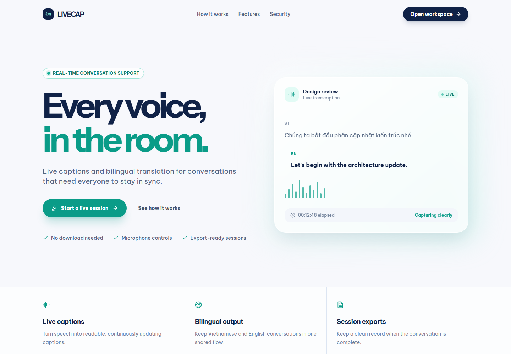
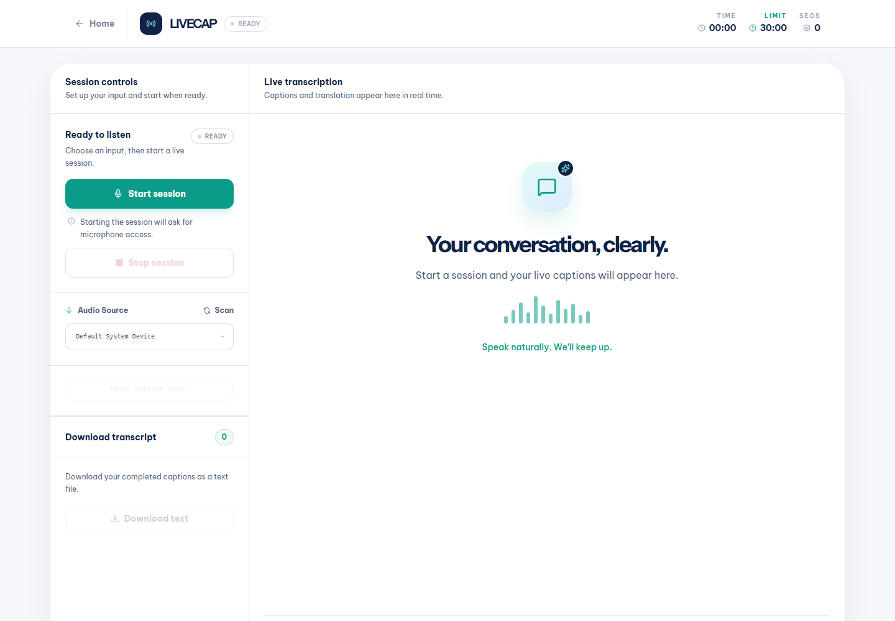
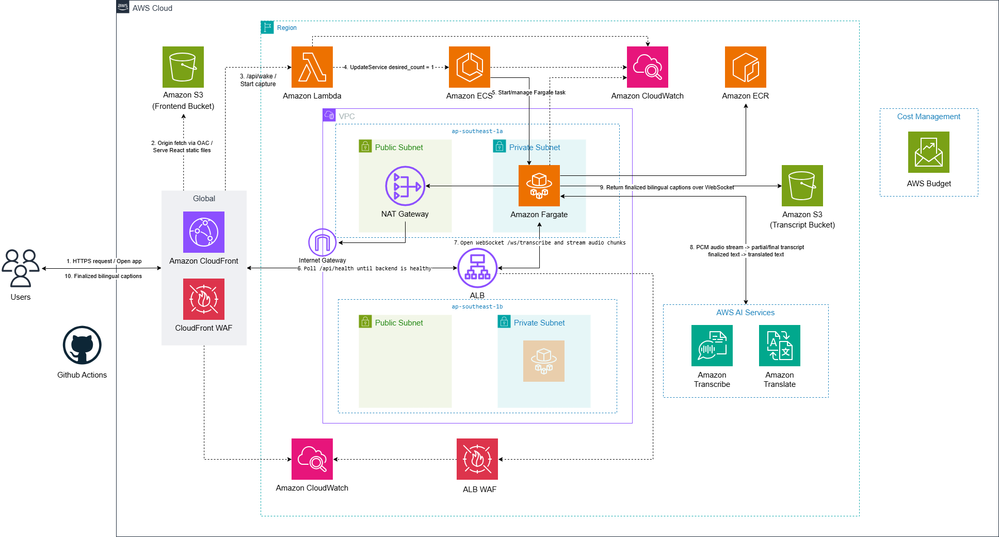

# LiveCap

[](https://github.com/9ducanh9/livecap/actions/workflows/ci.yml)

**Live demo:** [https://dpeohr327wt9l.cloudfront.net](https://dpeohr327wt9l.cloudfront.net)

**Demo guide:** [docs/demo-guide.md](docs/demo-guide.md)

LiveCap is a real-time speech caption and translation web application. It captures microphone audio in the browser, streams it to a FastAPI backend over a secure WebSocket (WSS), transcribes it with Amazon Transcribe Streaming, translates it with Amazon Translate, and displays bilingual captions side-by-side — Vietnamese on the left, English on the right. Sessions can be exported as TXT files and stored in Amazon S3 with a time-limited download link.

The application is deployed on AWS using a cloud-native architecture: the
frontend is served through Amazon CloudFront from S3, while the backend runs as
Docker containers on Amazon ECS Fargate behind an Application Load Balancer
(ALB). CloudFront terminates public HTTPS/WSS for the current demo and forwards
backend traffic to the ALB over its current HTTP origin connection. The target
ALB supports end-to-end TLS when an ACM certificate and backend domain are
configured.

The live URL currently uses the stable legacy ECS path with an immutable Git
SHA image. The private-subnet, scale-to-zero target stack is implemented in
Terraform and remains behind the reviewed state-import and blue/green cutover
gates.

---

## Product Preview

### Landing Page



### Caption Dashboard



---

## Table of Contents

1. [Product Preview](#product-preview)
2. [Prerequisites](#prerequisites)
3. [AWS Deployment Guide](#aws-deployment-guide)
   - [Initial Setup](#initial-setup)
   - [Backend Deployment](#backend-deployment)
   - [Infrastructure Provisioning](#infrastructure-provisioning)
   - [Frontend Deployment](#frontend-deployment)
   - [Environment Configuration](#environment-configuration)
4. [ECS Service Operations](#ecs-service-operations)
   - [Updating Backend Code](#updating-backend-code)
   - [Scaling ECS Service](#scaling-ecs-service)
   - [Rollback Procedure](#rollback-procedure)
5. [Monitoring and Troubleshooting](#monitoring-and-troubleshooting)
   - [Viewing Logs](#viewing-logs)
   - [Checking Service Health](#checking-service-health)
   - [Common Issues](#common-issues)
6. [Local Development](#local-development)
7. [Architecture Overview](#architecture-overview)
8. [Cost Optimization](#cost-optimization)

---

## Prerequisites

### Required Tools

| Tool | Version | Purpose |
|------|---------|---------|
| **AWS CLI** | v2 or later | AWS resource management and deployment |
| **Docker** | 24 or later | Building backend container images |
| **Terraform** | 1.10.x | Infrastructure as Code provisioning and S3 lockfiles |
| **Node.js** | 20 LTS | Building frontend application and matching CI |
| **npm** | 9 or later | Frontend dependency management |
| **Python** | 3.11+ | Local backend development (optional) |

### AWS Account Requirements

1. **Active AWS Account** with billing enabled
2. **IAM User/Role** with permissions to create:
   - S3 buckets
   - CloudFront distributions
   - ECS clusters and services
   - Application Load Balancers
   - IAM roles and policies
   - ECR repositories
   - CloudWatch log groups
   - VPC security groups

3. **AWS CLI Configuration**:
   ```bash
   aws configure
   # Enter your AWS Access Key ID
   # Enter your AWS Secret Access Key
   # Enter your default region (e.g., ap-southeast-1)
   # Enter output format (json recommended)
   ```

4. **Verify AWS Access**:
   ```bash
   aws sts get-caller-identity
   ```

### ECR Access

Ensure you have permissions to authenticate to Amazon ECR:

```bash
aws ecr get-login-password --region ap-southeast-1 | docker login --username AWS --password-stdin <your-account-id>.dkr.ecr.ap-southeast-1.amazonaws.com
```

---

---

## AWS Deployment Guide

This section covers deploying LiveCap to AWS using Terraform Infrastructure as Code.

> **Current source of truth:** use
> [`infrastructure/terraform/README.md`](infrastructure/terraform/README.md)
> together with
> [`infrastructure/terraform/IMPORT_PLAN.md`](infrastructure/terraform/IMPORT_PLAN.md).
> The existing AWS stack must be imported into the reviewed remote state before
> any main-stack apply. Do not use `terraform init -migrate-state`, do not apply
> an empty-state plan, and do not deploy an image tagged `latest`.

### Initial Setup

#### 1. Configure Infrastructure Variables

Navigate to your IaC directory:

```bash
cd infrastructure/terraform
```

**Terraform Example** (`terraform.tfvars`):
```hcl
aws_region   = "ap-southeast-1"
environment  = "production"
project_name = "livecap"

# S3 bucket names must be globally unique
frontend_bucket_name   = "my-company-livecap-frontend"
transcript_bucket_name = "my-company-livecap-transcripts"

# Target backend sizing and scale-to-zero
ecs_task_cpu                = 512    # 0.5 vCPU
ecs_task_memory             = 1024   # 1 GB RAM
backend_image_tag           = "54c423b" # Immutable Git SHA already in ECR
target_backend_desired_count = 0
backend_min_capacity        = 0
backend_max_capacity        = 1      # Keep max=1 while session limits are in-memory

# Lifecycle
transcript_retention_days = 14
session_timeout_seconds   = 1800

# Production backend TLS:
# alb_ssl_certificate_arn = "arn:aws:acm:REGION:ACCOUNT_ID:certificate/BACKEND_CERT_ID"
# backend_domain_name     = "api.livecap.example.com"
```

#### 2. Initialize IaC Tool

**Terraform:**
```bash
cd infrastructure/bootstrap/remote-state
terraform init
terraform validate
terraform plan

# After the reviewed bootstrap apply creates the state bucket:
cd ../../terraform
terraform init -reconfigure -backend-config=backend.hcl
terraform validate
```

---

### Backend Deployment

**IMPORTANT:** Push the backend image under an immutable Git SHA before updating
either ECS service. Both the live rollback service and the target service use
the Terraform `backend_image_tag` variable; do not deploy `latest`.

#### Step 1: Build Docker Image

```bash
cd backend
GIT_SHA=$(git rev-parse --short HEAD)
docker build -t livecap-backend:$GIT_SHA .
```

The Dockerfile includes:
- Pinned Python 3.11 slim Bookworm base image
- FastAPI application and dependencies
- Uvicorn ASGI server
- Python standard-library health checks (no extra runtime package)
- Environment variable configuration

#### Step 2: Authenticate to ECR

```bash
# Get ECR repository URI from infrastructure outputs (after provisioning)
# Or create ECR repository first:
aws ecr create-repository --repository-name livecap-backend --region ap-southeast-1

# Authenticate Docker to ECR
aws ecr get-login-password --region ap-southeast-1 | \
  docker login --username AWS --password-stdin <account-id>.dkr.ecr.ap-southeast-1.amazonaws.com
```

#### Step 3: Tag and Push Image

```bash
# Tag with the immutable Git SHA
docker tag livecap-backend:$GIT_SHA <account-id>.dkr.ecr.ap-southeast-1.amazonaws.com/livecap-backend:$GIT_SHA

# Push to ECR
docker push <account-id>.dkr.ecr.ap-southeast-1.amazonaws.com/livecap-backend:$GIT_SHA
```

**Tip:** Use `terraform output -raw ecr_repository_uri` to get the exact ECR URI.

---

### Infrastructure Provisioning

#### Using Terraform

**For the current parallel-stack migration:**

```bash
cd infrastructure/terraform

# Step 1: confirm all existing resources are present in remote state
terraform state list

# Step 2: run the reviewed imports from IMPORT_PLAN.md where needed

# Step 3: create a reviewable plan with traffic kept on the legacy ALB
terraform plan
```

The plan must keep `route_backend_to_target=false` and must not destroy or
replace the legacy ALB, ECS service, S3 buckets, or CloudFront distribution.
Apply is a separate human-approved action after plan review; it is intentionally
not included as a copy-paste step here.

**Resources Created:**
- 2 S3 buckets (frontend + transcripts with lifecycle policy)
- 1 CloudFront distribution (CDN for frontend)
- Existing rollback ALB plus one parallel target ALB (target HTTPS listener is
  enabled when an ACM certificate is configured)
- 1 ECS Fargate cluster
- 1 ECS service and task definition
- 1 ECR repository
- 2 CloudWatch log groups
- IAM roles and policies
- Security groups

#### Save Infrastructure Outputs

**Terraform:**
```bash
terraform output > outputs.txt
```

**Key Outputs:**
- `cloudfront_url` — Frontend public HTTPS URL
- `alb_backend_base_url` — Backend REST API URL
- `alb_websocket_url` — Backend WebSocket URL
- `ecr_repository_uri` — Docker registry
- `frontend_bucket_name` — S3 frontend bucket
- `transcript_bucket_name` — S3 transcript bucket
- `ecs_cluster_name` — ECS cluster name
- `ecs_service_name` — ECS service name
- `cloudfront_distribution_id` — For cache invalidation
- `cloudwatch_log_group_name` — Backend logs

---

### Frontend Deployment

#### Step 1: Configure Backend URL

Create production environment file:

```bash
cd frontend

# Set backend URLs from Terraform outputs
cat > .env.production << EOF
VITE_API_BASE_URL=<alb_backend_base_url>
VITE_WS_URL=<alb_websocket_url>
VITE_WAKE_BACKEND_URL=<wake_backend_url_if_enabled>
VITE_BACKEND_HEALTH_URL=<alb_backend_base_url>/api/health
VITE_BACKEND_WAKE_TIMEOUT_SECONDS=120
VITE_MAX_SESSION_SECONDS=1800
EOF
```

Use `terraform output -raw frontend_api_base_url` and
`terraform output -raw frontend_websocket_url` so browser traffic stays behind
CloudFront.

`VITE_WAKE_BACKEND_URL` is optional. Leave it empty unless `enable_wake_endpoint`
has been reviewed, applied, and the output `wake_backend_url` is available.
The hardened target uses `/api/wake`: CloudFront signs the origin request with
OAC and invokes an `AWS_IAM` Lambda Function URL. Anonymous direct Function URL
access is not allowed.

#### Step 2: Build Production Bundle

```bash
npm install
npm run build
```

This creates an optimized build in `frontend/dist/`.

#### Step 3: Upload to S3

```bash
# Sync build to Frontend_Bucket
aws s3 sync dist/ s3://<frontend-bucket-name>/ --delete

# Example with actual bucket name:
aws s3 sync dist/ s3://my-company-livecap-frontend/ --delete
```

The `--delete` flag removes old files not in the new build.

#### Step 4: Invalidate CloudFront Cache

```bash
aws cloudfront create-invalidation \
  --distribution-id <cloudfront-distribution-id> \
  --paths "/*"
```

Cache invalidation propagates globally in 1-2 minutes.

**Verification:**
```bash
# Get CloudFront URL
echo "Frontend URL: https://<cloudfront-domain>"

# Test in browser - should load the LiveCap interface
```

---

### Environment Configuration

#### Backend Environment Variables

Backend configuration is injected via ECS task definition environment variables:

| Variable | Required | Description | Example |
|----------|----------|-------------|---------|
| `AWS_REGION` | Yes | AWS region for all regional services | `ap-southeast-1` |
| `S3_BUCKET` | Yes | S3 bucket for transcripts | `my-livecap-transcripts` |
| `ALLOWED_ORIGIN` | Yes | Frontend CloudFront URL | `https://d123abc.cloudfront.net` |
| `SESSION_TIMEOUT` | No | Max session duration (seconds) | `1800` |
| `DOWNLOAD_LINK_EXPIRATION` | No | Pre-signed URL expiration (seconds) | `86400` |
| `MAX_SPEAKERS` | No | Transcribe diarization max speakers | `5` |
| `CLOUDWATCH_LOG_GROUP` | No | CloudWatch log group | `/ecs/livecap-backend` |
| `ENABLE_IDLE_SCALE_DOWN` | No | Let backend request ECS desired count 0 after the last session ends | `false` |
| `IDLE_SCALE_DOWN_GRACE_SECONDS` | No | Delay before idle scale-down | `300` |
| `ECS_CLUSTER_NAME` | No | ECS cluster name for idle scale-down | `livecap-cluster-dev` |
| `ECS_SERVICE_NAME` | No | ECS service name for idle scale-down | `livecap-backend-service-dev` |

**Configuration in Terraform:**
```hcl
# In ecs.tf task definition
environment = [
  {
    name  = "AWS_REGION"
    value = var.aws_region
  },
  {
    name  = "S3_BUCKET"
    value = aws_s3_bucket.transcript.id
  },
  {
    name  = "ALLOWED_ORIGIN"
    value = "https://${aws_cloudfront_distribution.frontend.domain_name}"
  }
]
```

**No AWS Credentials Required:** ECS tasks use the task IAM role for AWS SDK authentication — never embed access keys.

#### Frontend Environment Variables

Frontend configuration is set at build time:

| Variable | Required | Description | Example |
|----------|----------|-------------|---------|
| `VITE_API_BASE_URL` | Yes | Backend API endpoint | `https://alb-dns.elb.amazonaws.com` |
| `VITE_WS_URL` | Yes | Backend WebSocket endpoint | `wss://alb-dns.elb.amazonaws.com/ws/transcribe` |
| `VITE_WAKE_BACKEND_URL` | No | Optional Lambda Function URL that wakes ECS from scale-to-zero before capture starts | `https://abc.lambda-url.ap-southeast-1.on.aws/` |
| `VITE_BACKEND_HEALTH_URL` | No | Health endpoint polled after wake | `https://api.livecap.example.com/api/health` |
| `VITE_BACKEND_WAKE_TIMEOUT_SECONDS` | No | Max wait for backend readiness | `120` |
| `VITE_MAX_SESSION_SECONDS` | No | UI max session countdown; keep aligned with `SESSION_TIMEOUT` | `1800` |

Set in `.env.production` before running `npm run build`.

---

## ECS Service Operations

### Updating Backend Code

When you make changes to the backend application, follow these steps to deploy the new version:

#### 1. Build and Push New Docker Image

```bash
cd backend

# Build with version tag
docker build -t livecap-backend:v2 .

# Tag for ECR
docker tag livecap-backend:v2 <account-id>.dkr.ecr.ap-southeast-1.amazonaws.com/livecap-backend:v2

# Push to ECR
docker push <account-id>.dkr.ecr.ap-southeast-1.amazonaws.com/livecap-backend:v2
```

#### 2. Update ECS Task Definition

**Option A: Register new task definition revision (Terraform)**
```bash
cd infrastructure/terraform

# Update backend_image_tag in the untracked terraform.tfvars
# Then review the plan before a separately approved apply:
terraform plan
```

**Option B: Register new task definition (AWS CLI)**
```bash
# Get current task definition
aws ecs describe-task-definition \
  --task-definition livecap-backend \
  --query 'taskDefinition' > task-def.json

# Edit task-def.json to update the image URI to :v2
# Remove fields: taskDefinitionArn, revision, status, requiresAttributes, compatibilities, registeredAt, registeredBy

# Register new revision
aws ecs register-task-definition --cli-input-json file://task-def.json
```

#### 3. Update ECS Service

```bash
aws ecs update-service \
  --cluster <ecs-cluster-name> \
  --service <ecs-service-name> \
  --task-definition livecap-backend:2 \
  --force-new-deployment
```

Replace `livecap-backend:2` with the new task definition revision number.

#### 4. Monitor Deployment

```bash
# Watch deployment progress
aws ecs describe-services \
  --cluster <ecs-cluster-name> \
  --services <ecs-service-name> \
  --query 'services[0].deployments'

# Check running count
aws ecs describe-services \
  --cluster <ecs-cluster-name> \
  --services <ecs-service-name> \
  --query 'services[0].{Running:runningCount,Desired:desiredCount}'
```

Wait until `runningCount` equals `desiredCount` and the new deployment shows `PRIMARY` status.

---

### Scaling ECS Service

#### Manual Scaling

Adjust the number of running tasks:

```bash
# Wake the backend for a demo session
aws ecs update-service \
  --cluster <ecs-cluster-name> \
  --service <ecs-service-name> \
  --desired-count 1
```

**Terraform:**
```hcl
# Update terraform.tfvars
backend_desired_count = 1

# Review before any separately approved apply
terraform plan
```

Keep `backend_max_capacity = 1` until the active session registry moves from
process memory to a shared store such as DynamoDB or Redis.

#### Auto-Scaling (Optional Enhancement)

Set up target tracking based on CPU utilization:

```bash
# Register scalable target
aws application-autoscaling register-scalable-target \
  --service-namespace ecs \
  --resource-id service/<cluster-name>/<service-name> \
  --scalable-dimension ecs:service:DesiredCount \
  --min-capacity 1 \
  --max-capacity 5

# Create scaling policy
aws application-autoscaling put-scaling-policy \
  --service-namespace ecs \
  --resource-id service/<cluster-name>/<service-name> \
  --scalable-dimension ecs:service:DesiredCount \
  --policy-name livecap-cpu-scaling \
  --policy-type TargetTrackingScaling \
  --target-tracking-scaling-policy-configuration \
    '{"TargetValue":70.0,"PredefinedMetricSpecification":{"PredefinedMetricType":"ECSServiceAverageCPUUtilization"}}'
```

---

### Rollback Procedure

If a new deployment causes issues, rollback to the previous task definition:

```bash
# List task definition revisions
aws ecs list-task-definitions --family-prefix livecap-backend

# Update service to previous revision
aws ecs update-service \
  --cluster <ecs-cluster-name> \
  --service <ecs-service-name> \
  --task-definition livecap-backend:1
```

**Monitor rollback:**
```bash
aws ecs describe-services \
  --cluster <ecs-cluster-name> \
  --services <ecs-service-name> \
  --query 'services[0].events[0:5]'
```

---

## Monitoring and Troubleshooting

### Viewing Logs

#### Real-Time Log Streaming

```bash
# Tail all backend logs
aws logs tail /ecs/livecap-backend --follow

# View logs from last hour
aws logs tail /ecs/livecap-backend --since 1h

# Filter by specific session
aws logs tail /ecs/livecap-backend --follow --filter-pattern "session_id:abc-123"
```

#### CloudWatch Log Insights Queries

Navigate to CloudWatch → Log Insights and run queries:

**Find all errors:**
```
fields @timestamp, @message
| filter @message like /ERROR/
| sort @timestamp desc
| limit 50
```

**Session duration analysis:**
```
fields @timestamp, session_id, message
| filter message like /session_start/ or message like /session_end/
| stats count() by session_id
```

---

### Checking Service Health

#### ALB Target Health

```bash
# Get target group ARN from outputs
aws elbv2 describe-target-health \
  --target-group-arn <target-group-arn>
```

**Healthy Response:**
```json
{
  "TargetHealthDescriptions": [
    {
      "Target": {
        "Id": "10.0.1.100",
        "Port": 8000
      },
      "TargetHealth": {
        "State": "healthy"
      }
    }
  ]
}
```

#### ECS Service Status

```bash
# Check service health
aws ecs describe-services \
  --cluster <ecs-cluster-name> \
  --services <ecs-service-name> \
  --query 'services[0].{Status:status,Running:runningCount,Desired:desiredCount,Healthy:healthCheckGracePeriodSeconds}'

# List running tasks
aws ecs list-tasks \
  --cluster <ecs-cluster-name> \
  --service-name <ecs-service-name>

# Describe specific task
aws ecs describe-tasks \
  --cluster <ecs-cluster-name> \
  --tasks <task-arn>
```

#### Application Health Check

```bash
# Test health endpoint directly
curl <alb_backend_base_url>/api/health
```

**Expected Response:**
```json
{
  "status": "healthy",
  "version": "1.0.0"
}
```

---

### Common Issues

#### Issue: ECS Tasks Not Starting

**Symptoms:** `runningCount` stays at 0; tasks fail health checks

**Debugging Steps:**
```bash
# Check stopped tasks
aws ecs list-tasks \
  --cluster <ecs-cluster-name> \
  --desired-status STOPPED \
  --max-results 5

# Get stop reason
aws ecs describe-tasks \
  --cluster <ecs-cluster-name> \
  --tasks <stopped-task-arn> \
  --query 'tasks[0].{StopReason:stoppedReason,StopCode:stopCode}'
```

**Common Causes:**
1. **Docker image not found in ECR** → Push image to ECR
2. **Insufficient IAM permissions** → Check task role policies
3. **Container startup failure** → Check CloudWatch logs for errors
4. **Health check failing** → Verify `/api/health` endpoint works

**Solutions:**
```bash
# Verify image exists
aws ecr describe-images \
  --repository-name livecap-backend \
  --query 'imageDetails[*].imageTags'

# Check task execution role
aws iam get-role --role-name ecsTaskExecutionRole

# Test container locally
docker run -p 8000:8000 <ecr-uri>:<GIT_SHA>
curl http://localhost:8000/api/health
```

#### Issue: ALB Health Checks Failing

**Symptoms:** Tasks start but immediately stop; ALB reports unhealthy targets

**Debugging Steps:**
```bash
# Check target health details
aws elbv2 describe-target-health \
  --target-group-arn <target-group-arn> \
  --query 'TargetHealthDescriptions[*].{Target:Target.Id,Health:TargetHealth.State,Reason:TargetHealth.Reason}'
```

**Common Causes:**
1. **Security group misconfiguration** → ECS task SG must allow inbound 8000 from ALB SG
2. **Container port mismatch** → Task definition port must match application port (8000)
3. **Health check path incorrect** → Must be `/api/health`
4. **Application startup delay** → Increase health check grace period

**Solutions:**
```bash
# Verify security group rules
aws ec2 describe-security-groups \
  --group-ids <ecs-task-sg-id> \
  --query 'SecurityGroups[0].IpPermissions'

# Update health check grace period
aws ecs update-service \
  --cluster <ecs-cluster-name> \
  --service <ecs-service-name> \
  --health-check-grace-period-seconds 120
```

#### Issue: WebSocket Connection Fails

**Symptoms:** Frontend connects but WebSocket upgrade fails; CORS errors

**Debugging Steps:**
```bash
# Check backend logs for connection errors
aws logs tail /ecs/livecap-backend --follow --filter-pattern "WebSocket"

# Test WebSocket with wscat
npm install -g wscat
wscat -c <alb_websocket_url>
```

**Common Causes:**
1. **CORS origin mismatch** → `ALLOWED_ORIGIN` must match CloudFront URL exactly
2. **ALB doesn't support WebSocket upgrade** → ALB supports this by default; verify listener config
3. **Security group blocks traffic** → Check ALB → ECS task connectivity

**Solutions:**
```bash
# Verify ALLOWED_ORIGIN environment variable in task definition
aws ecs describe-task-definition \
  --task-definition livecap-backend \
  --query 'taskDefinition.containerDefinitions[0].environment'

# Update task definition with correct ALLOWED_ORIGIN
# Then force new deployment
```

#### Issue: High AWS Costs

**Symptoms:** Unexpected Transcribe/Translate charges

**Cost Monitoring:**
```bash
# Enable CloudWatch billing alerts
aws cloudwatch put-metric-alarm \
  --alarm-name livecap-high-cost \
  --alarm-description "Alert when estimated charges exceed threshold" \
  --metric-name EstimatedCharges \
  --namespace AWS/Billing \
  --statistic Maximum \
  --period 21600 \
  --threshold 100 \
  --comparison-operator GreaterThanThreshold
```

**Main Cost Drivers:**
1. **Amazon Transcribe:** ~$0.024/minute × 2 streams = $0.048/minute
2. **Amazon Translate:** ~$15 per million characters
3. **ECS Fargate:** ~$0.04/vCPU-hour + $0.004/GB-hour
4. **ALB:** ~$0.0225/hour + data processing

**Optimization Strategies:**
- Set shorter `SESSION_TIMEOUT` to prevent abandoned sessions
- Use AWS Free Tier during testing (S3, CloudWatch)
- Keep transcript retention at 14 days, or shorten it further if the product requirements allow
- Monitor usage in AWS Cost Explorer
- Consider single-language Transcribe stream if accuracy permits (50% cost reduction)

---

## Local Development

Run the backend and frontend in separate terminals:

**Terminal 1 — Backend**

```bash
cd livecap/backend
cp .env.example .env
# Edit .env: set AWS_REGION, S3_BUCKET, ALLOWED_ORIGIN=http://localhost:5173
pip install -r requirements.txt
uvicorn app.main:app --reload --host 0.0.0.0 --port 8000
```

The API is available at `http://localhost:8000`. Health check: `http://localhost:8000/api/health`.

**Terminal 2 — Frontend**

```bash
cd livecap/frontend
npm install
VITE_API_BASE_URL=http://localhost:8000 \
VITE_WS_URL=ws://localhost:8000/ws/transcribe \
npm run dev
```

The app opens at `http://localhost:5173`.

> **Note:** Local development uses plain `ws://` and `http://` (no TLS). Public
> production traffic uses `wss://` and `https://`. The current demo uses an
> HTTP CloudFront-to-ALB origin; configure the target ALB certificate and
> backend domain for encrypted origin traffic.

---

## Architecture Overview

### Production Deployment Architecture

The diagram below shows the logical request path. The currently deployed demo
still runs the rollback ECS service in the default VPC with public task IPs.
The reviewed target design moves Fargate into two private subnets across
`ap-southeast-1a` and `ap-southeast-1b`, adds one NAT Gateway, keeps one
multi-AZ ALB, and performs a parallel-stack blue/green-style cutover. See
[`docs/post-v1.5-requirements-design-flow.md`](docs/post-v1.5-requirements-design-flow.md)
for the target architecture and migration gates.



```
┌──────────────────────────────────────────────────────────────────────┐
│                        End User Browser                              │
└──────────────┬────────────────────────────────┬──────────────────────┘
               │ HTTPS (static assets)          │ WSS (audio stream)
               ▼                                ▼
 ┌──────────────────────────┐       ┌────────────────────────────────┐
 │ Amazon CloudFront (CDN)  │       │ Application Load Balancer (ALB)│
 │   + TLS certificate      │       │   + TLS termination            │
 └───────────┬──────────────┘       │   + Health checks              │
             │ origin fetch         │   + Target groups              │
             ▼                      └────────────┬───────────────────┘
 ┌──────────────────────────┐                   │ HTTP/WSS (internal)
 │ Frontend_Bucket (S3)     │                   ▼
 │ - Static React bundle    │       ┌────────────────────────────────┐
 │ - Public read (CF only)  │       │  Amazon ECS Fargate Service    │
 └──────────────────────────┘       │  ┌──────────────────────────┐  │
                                    │  │  ECS Task (Docker)       │  │
                                    │  │  ┌────────────────────┐  │  │
                                    │  │  │ FastAPI + Uvicorn  │  │  │
                                    │  │  │ /api/health        │  │  │
                                    │  │  │ /ws/transcribe     │  │  │
                                    │  │  └────────────────────┘  │  │
                                    │  └──────────────────────────┘  │
                                    └────────────┬───────────────────┘
                                                 │ AWS SDK (boto3)
                                                 │ + IAM Task Role
                                                 ▼
                   ┌────────────────────────────────────────────────────┐
                   │ AWS Services                                       │
                   │ - Amazon Transcribe Streaming                      │
                   │ - Amazon Translate                                 │
                   │ - Transcript_Bucket (S3, private)                  │
                   │ - Amazon CloudWatch Logs                           │
                   └────────────────────────────────────────────────────┘
```

### Components

- **Frontend:** React + TypeScript application built with Vite, hosted on Amazon S3, distributed globally via Amazon CloudFront with HTTPS
- **Backend:** FastAPI (Python 3.11+) packaged as a Docker container, running on Amazon ECS Fargate
- **Load Balancer:** Application Load Balancer health-checks and routes API and
  WebSocket traffic to ECS tasks; TLS termination is enabled on the target ALB
  only when its ACM certificate is configured
- **Transcription:** Amazon Transcribe Streaming with parallel Vietnamese (vi-VN) and English (en-US) fixed-language streams for accurate bilingual transcription
- **Translation:** Amazon Translate for Vietnamese ↔ English translation
- **Storage:** Two isolated S3 buckets:
  - Frontend_Bucket: Static assets (public via CloudFront OAC)
  - Transcript_Bucket: Exported transcripts (private, backend-only access with IAM role)
- **Monitoring:** Amazon CloudWatch Logs with structured JSON logging
- **Container Registry:** Amazon ECR for Docker image storage

### Key Design Decisions

**Why ECS Fargate + ALB?**
- **Operational Excellence:** Automatic task restart; container packaging ensures consistency; CloudWatch integration
- **Security:** CloudFront viewer TLS, optional target ALB origin TLS, IAM task
  roles with no embedded credentials, and isolated S3 buckets
- **Reliability:** ECS auto-restarts failed tasks; ALB routes only to healthy targets; stateless design enables scaling
- **Performance:** Right-sized Fargate tasks; CloudFront CDN reduces latency globally
- **Cost Optimization:** Pay-per-use pricing; no idle EC2 costs; 14-day retention for transcripts and logs; no raw audio storage
- **Sustainability:** Automated data lifecycle management reduces environmental impact by limiting unnecessary storage

---

## Cost Optimization

### Estimated Monthly Costs

#### Development Environment (Low Usage - 10 hours/month)

| Service | Configuration | Monthly Cost |
|---------|--------------|--------------|
| ECS Fargate | 1 task x 0.5 vCPU x 1 GB x 10 hours | ~$0.60 |
| ALB | One ALB remains provisioned for the full month | ~$16 |
| S3 Storage | 1 GB | $0.02 |
| CloudFront | 10 GB transfer | $1 |
| Transcribe | 10 hours x 2 streams x $0.024/min | $28.80 |
| Translate | 100K characters | $1.50 |
| **Base subtotal** | Excludes NAT Gateway, WAF, taxes, and data processing | **~$47.92/month** |

#### Production Environment (Moderate Usage - 100 hours/month)

| Service | Configuration | Monthly Cost |
|---------|--------------|--------------|
| ECS Fargate | 1 task x 0.5 vCPU x 1 GB x 100 hours | ~$3 |
| ALB | Full month + data processing | ~$23 |
| S3 Storage | 10 GB | $0.23 |
| CloudFront | 100 GB transfer | $8.50 |
| Transcribe | 100 hours x 2 streams x $0.024/min | $288 |
| Translate | 5M characters | $75 |
| **Base subtotal** | Excludes NAT Gateway, WAF, taxes, and data processing | **~$397.73/month** |

**Note:** These are order-of-magnitude estimates, not quotes. Check the AWS
Pricing Calculator before deployment. The target architecture adds one NAT
Gateway and two WAF web ACLs; both keep charging while ECS is scaled to zero.
AWS WAF charges per web ACL, rule/rule group, and request. The `$50` AWS Budget
is an alerting guardrail, not a spending cap, and the complete target stack may
exceed it even at low traffic.

### Cost Reduction Strategies

1. **AWS Free Tier:** During testing:
   - S3: 5 GB storage, 20,000 GET requests
   - CloudFront: 1 TB data transfer out
   - CloudWatch Logs: 5 GB ingestion

2. **Session Timeout:** Set `SESSION_TIMEOUT=1800` (30 minutes) to prevent abandoned long-running transcriptions

3. **S3 Lifecycle Policy:** Transcripts are automatically deleted after 14 days (configurable via `transcript_retention_days`):
   ```bash
   # Update in Terraform variables if different retention is needed
   transcript_retention_days = 14
   ```

4. **CloudWatch Log Retention:** Logs are retained for 14 days (configurable via `log_retention_days`):
   ```bash
   # Update in Terraform variables if different retention is needed
   log_retention_days = 14
   ```

5. **No Raw Audio Storage:** LiveCap MVP does not store raw audio files. Only exported transcript TXT files are retained in S3, significantly reducing storage costs.

6. **Single-Language Detection (Future):** Consider replacing dual-stream Transcribe with single `identify-language` mode if accuracy permits (50% cost reduction on Transcribe)

7. **Monitor Usage:**
   ```bash
   # Set up billing alerts
   aws cloudwatch put-metric-alarm \
     --alarm-name livecap-cost-alert \
     --metric-name EstimatedCharges \
     --namespace AWS/Billing \
     --threshold 50 \
     --comparison-operator GreaterThanThreshold
   ```

8. **Scheduled Scale-to-Zero:** For demo environments, Terraform can scale the
   ECS service to 0 outside demo hours and back to 1 during demo hours through
   `enable_demo_scheduled_scaling`.

9. **Optional Wake Endpoint:** If `enable_wake_endpoint=true` is reviewed and
   applied, the frontend can call `VITE_WAKE_BACKEND_URL` before opening the
   WebSocket. This lets a scaled-to-zero ECS service start on demand. It does
   not remove ALB, NAT Gateway, or WAF fixed costs. The browser calls
   `/api/wake` through CloudFront; OAC signs the request to the IAM-protected
   Lambda Function URL.

10. **Idle Backend Scale-Down:** If `ENABLE_IDLE_SCALE_DOWN=true`, the backend
   waits for `IDLE_SCALE_DOWN_GRACE_SECONDS` after the last active session ends,
   then requests ECS desired count 0. A new session cancels the pending
   scale-down.

11. **Budget Guardrail:** Terraform can create a `$50/month` AWS Budget alert
   when `budget_notification_email` is set. AWS Budget alerts are not
   real-time and can lag behind actual usage.

The target architecture keeps a multi-AZ ALB for stable ECS routing and health
checks, while Fargate tasks run without public IPs in two private subnets. One
NAT Gateway provides outbound access as an MVP cost tradeoff. ECS scale-to-zero
reduces idle compute cost only; ALB, NAT Gateway, and enabled WAF resources
retain fixed cost.

---

## Additional Resources

### Documentation

- [Demo guide](docs/demo-guide.md) - short, reviewer-facing live demonstration flow
- [Current infrastructure status](infrastructure/README.md) - deployed versus target architecture boundaries
- [Terraform source of truth](infrastructure/terraform/README.md) - reviewed variables, resources, and safe workflow
- [State import plan](infrastructure/terraform/IMPORT_PLAN.md) - required gate before any main-stack apply
- [Requirements, design, and runtime flows](docs/post-v1.5-requirements-design-flow.md) - implementation and verification baseline

The files under `deploy/`, `infrastructure/DEPLOYMENT_GUIDE.md`, and
`infrastructure/QUICK_REFERENCE.md` are retained as legacy references. They are
not the source of truth for the current immutable-image ECS deployment.

### AWS Documentation

- [Amazon ECS on Fargate](https://docs.aws.amazon.com/AmazonECS/latest/developerguide/AWS_Fargate.html)
- [Application Load Balancer](https://docs.aws.amazon.com/elasticloadbalancing/latest/application/)
- [Amazon Transcribe Streaming](https://docs.aws.amazon.com/transcribe/latest/dg/streaming.html)
- [Amazon Translate](https://docs.aws.amazon.com/translate/)
- [Amazon CloudFront](https://docs.aws.amazon.com/cloudfront/)

### Support

For issues or questions:
1. Check the [Monitoring and Troubleshooting](#monitoring-and-troubleshooting) section above
2. Review CloudWatch Logs for error messages
3. Consult the detailed deployment guides in `infrastructure/`

---

## License

This repository is an academic project. No open-source license has been
assigned.
