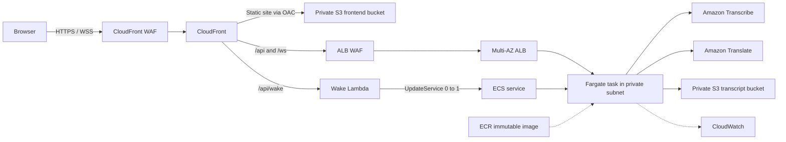

# LiveCap

> Real-time Vietnamese-English captions for meetings, built on AWS.

[](https://github.com/9ducanh9/livecap/actions/workflows/ci.yml)
[](https://github.com/9ducanh9/livecap/releases/latest)

[Live demo](https://livecap.logantai.com/) | [Open workspace](https://livecap.logantai.com/app) | [Demo guide](docs/demo-guide.md) | [Architecture](docs/as-deployed-architecture.md)


## Contents

- [Problem](#problem)
- [Solution](#solution)
- [Architecture](#architecture)
- [Quick Start](#quick-start)
- [Operational Facts](#operational-facts)
- [Tech Stack](#tech-stack)
- [Project Structure](#project-structure)
- [Verification](#verification)

## Problem

Vietnamese-English meetings lose context when participants wait for manual
translation or receive notes after the conversation. LiveCap makes the spoken
conversation readable as it happens, while keeping the operator workflow
small: open the app, choose a microphone, and start a session.

## Solution

The browser captures microphone audio and sends 16 kHz PCM through a secure
WebSocket. A FastAPI backend running on ECS Fargate streams it to Amazon
Transcribe, translates finalized text with Amazon Translate, and returns
bilingual captions to the browser. Exported TXT transcripts are private S3
objects; LiveCap does not store raw audio.

## Architecture



CloudFront is the browser entry point. It serves the React frontend from a
private S3 bucket and routes API/WebSocket traffic to the ALB. The Fargate task
has no public IP; ALB and CloudFront each have a WAF Web ACL. See the
[as-deployed architecture](docs/as-deployed-architecture.md) for request,
wake, idle, security, and availability flows.


## Quick Start

Prerequisites: Python 3.11+, Node.js 20+, and AWS credentials when testing real
Transcribe, Translate, or S3 operations. Never place AWS access keys in `.env`.

```powershell
git clone https://github.com/9ducanh9/livecap.git
cd livecap

# Terminal 1: backend
cd backend
python -m venv .venv
.\.venv\Scripts\Activate.ps1
python -m pip install -r requirements-dev.txt
Copy-Item .env.example .env
python -m uvicorn app.main:app --reload --host 127.0.0.1 --port 8000
```

```powershell
# Terminal 2: frontend
cd frontend
npm ci
Copy-Item .env.example .env
npm run dev
```

Open `http://127.0.0.1:5173`. For local Cognito, Stripe, and feature-flag
configuration, use [the local run guide](docs/run-local.md).

## Operational Facts

| Area | Current design |
| --- | --- |
| Compute | ECS Fargate scales from 0 to 1 task; current maximum is one task |
| Cold start | The first session after idle normally waits about 30-60 seconds for Fargate and health checks |
| Session safety | WebSocket heartbeat, bounded reconnects, a 30-minute limit, and concurrent-session guards |
| Data retention | Private transcript objects and Terraform-managed logs are retained for 14 days |
| Storage | Finalized text exports only; no raw audio storage |
| Cost trade-off | Scale-to-zero reduces idle Fargate cost; ALB, NAT Gateways, and WAF retain baseline cost |

## Tech Stack

| Layer | Technology |
| --- | --- |
| Frontend | React 18, TypeScript, Vite, Tailwind CSS, GSAP |
| Backend | Python 3.11, FastAPI, Uvicorn, WebSocket |
| Speech and translation | Amazon Transcribe Streaming, Amazon Translate |
| Compute and delivery | ECS Fargate, Docker, Amazon ECR, GitHub Actions |
| Edge and network | CloudFront, AWS WAF, ALB, custom two-AZ VPC, NAT Gateway |
| Data and operations | Amazon S3, DynamoDB, Cognito, CloudWatch, Terraform |

## Project Structure

```text
livecap/
|-- backend/                    # FastAPI application, services, and tests
|-- frontend/                   # React application, UI, and tests
|-- infrastructure/
|   |-- bootstrap/              # Remote Terraform state bootstrap
|   `-- terraform/              # AWS infrastructure source of truth
|-- docs/                       # Demo, architecture, rollout, and run guides
|-- .github/workflows/          # CI and deployment workflow definitions
|-- COLLAB_LOG.md               # Shared implementation log for contributors
`-- README.md
```

## Verification

```powershell
# Backend
cd backend
python -m compileall app
python -m pytest

# Frontend
cd frontend
npm test
npm run build
```

Terraform validation instructions are in
[infrastructure/terraform/README.md](infrastructure/terraform/README.md).
CI never applies infrastructure or migrates Terraform state.

## Documentation

- [Documentation index](docs/README.md)
- [Three-minute demo guide](docs/demo-guide.md)
- [As-deployed architecture](docs/as-deployed-architecture.md)
- [Upgrade roadmap](docs/upgrade-roadmap.md)
- [Proposed LiveCap Rooms direction](docs/shared-rooms-product-direction.md)
- [Infrastructure overview](infrastructure/README.md)

## License and Author

This is an academic capstone project; no open-source license has been assigned.

Built by [Lam Chi Tai](https://github.com/9ducanh9).
