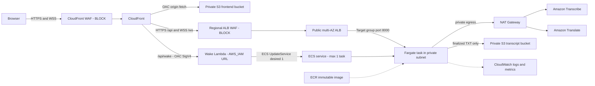

# LiveCap

[](https://github.com/9ducanh9/livecap/actions/workflows/ci.yml)
[](https://github.com/9ducanh9/livecap/releases/latest)

LiveCap is a real-time Vietnamese-English meeting caption application. It
captures microphone audio in the browser, streams 16 kHz PCM over a secure
WebSocket, transcribes speech with Amazon Transcribe, translates finalized text
with Amazon Translate, and displays bilingual captions side by side.

- [Live demo](https://livecap.logantai.com/)
- [Open the caption workspace](https://livecap.logantai.com/app)
- [Latest tagged release](https://github.com/9ducanh9/livecap/releases/latest)
- [Three-minute demo guide](docs/demo-guide.md)
- [Verified as-deployed architecture](docs/as-deployed-architecture.md)

> **Cold-start notice:** To reduce idle cost, LiveCap scales its ECS backend to
> zero after five minutes without an active session. The first **Start session**
> after an idle period usually takes 30-60 seconds while Fargate starts and
> passes its health check. During that window, `/api/health` may temporarily
> return `503 Service Unavailable`; keep the workspace open while it shows
> **Starting backend**. The UI retries for up to 120 seconds.

The latest tagged release is `v1.5.2`. The live environment also includes
post-release frontend and AWS hardening tracked in
[PR #4](https://github.com/9ducanh9/livecap/pull/4).

## Update Branch Tracking

The active development branch is [`Update`](https://github.com/9ducanh9/livecap/tree/Update).
It contains the next reviewed batches, tracked in [`COLLAB_LOG.md`](COLLAB_LOG.md).
The following is **not deployed to the live demo yet**:

- **AI meeting notes:** after a session ends, the participant can choose
  **Create meeting notes**. Only that explicit action sends finalized captions
  to Amazon Bedrock for a bilingual summary, decisions, action items, keywords,
  insights, glossary, and follow-up questions. Pressing Stop never calls
  Bedrock or creates a Bedrock charge.
- The API is `POST /api/sessions/{session_id}/summary`. It is disabled by
  default through `ENABLE_MEETING_SUMMARY=false`; requests need at least three
  finalized captions and are not persisted by that endpoint.
- The current `Update` code has passed 242 backend tests and 18 frontend tests,
  including the explicit-button flow. It still needs a reviewed backend-image
  deployment plus the existing Terraform/IAM feature flag before it can be
  enabled in AWS.
- The branch also contains optional reliability and transcription-accuracy
  improvements. They remain disabled until their deployment plan is reviewed.
- **Accounts and transcript history:** the next product feature is implemented
  behind `enable_cognito_auth=false`. When reviewed and enabled, Cognito Hosted
  UI signs users in, each export is associated with that user in DynamoDB, and
  the private TXT object stays in S3. History metadata and TXT objects follow
  the existing 14-day retention; raw audio is never stored. This is not
  deployed to the live demo yet.

For local Bedrock testing, see [`docs/run-local.md`](docs/run-local.md). For the
handoff and human-reviewed deployment gate, see [`HANDOFF.md`](HANDOFF.md).

## Product Preview

### Landing Page


### Caption Workspace

This screenshot shows the current production caption workspace in its ready
state before microphone capture begins.


## Core Capabilities

- Real-time English and Vietnamese transcription through parallel Amazon
  Transcribe streams.
- Finalized bilingual caption rows with speaker labels and timestamps.
- Browser microphone capture with 16 kHz, 16-bit, mono PCM output.
- WebSocket heartbeat and three bounded reconnect attempts using 1, 2, and 4
  second backoff.
- Process-local global and per-IP session limits.
- Thirty-minute session limit with automatic stop.
- TXT transcript export to private S3 through a time-limited presigned URL.
- Wake-on-demand ECS startup and five-minute idle scale-down.
- No raw audio storage.
- Optional Cognito sign-in and owner-scoped transcript history (disabled by
  default until its reviewed infrastructure rollout).

## Verified Deployment Baseline

The current branch and live AWS path were verified on 2026-07-14:

| Area | Evidence |
|---|---|
| Backend | 208 tests pass on Python 3.11 |
| Frontend | 14 tests pass; TypeScript and Vite production build pass |
| Terraform | Formatting, `init -backend=false`, and validation pass |
| Secret hygiene | Gitleaks passes; no tracked tfstate, tfvars, backend config, or real `.env` files |
| GitHub CI | Backend, Frontend, Terraform, and Secret scan jobs pass in [run 29290866973](https://github.com/9ducanh9/livecap/actions/runs/29290866973) |
| Backend compute | ECS service `livecap-target-service-dev`, task definition `livecap-target-backend-dev:3` |
| Container | Immutable ECR image `84c95f5-amd64` |
| Network | Custom VPC, two public and two private subnets across `ap-southeast-1a` and `ap-southeast-1b`; Fargate has no public IP |
| Edge security | CloudFront WAF and ALB WAF use blocking managed and rate-based rules |
| Scale behavior | Wake `0 -> 1`, idle `1 -> 0`, and ECS task replacement were verified |
| Production flow | Health polling, WSS, transcription, translation, heartbeat, stop, export, and download pass |
| Retention | Transcript objects and Terraform-managed ECS/Lambda/WAF logs: 14 days; the direct Watchtower log group still needs a retention policy |

## Architecture



CloudFront is the only browser-facing application entrypoint. It serves the
React frontend from private S3, routes `/api/*` and `/ws/*` to the HTTPS ALB
origin, and routes `/api/wake` to an IAM-protected Lambda Function URL signed by
CloudFront Origin Access Control.

The ALB spans two public subnets. The ECS Fargate task can be placed in either
of two private subnets with `assign_public_ip=false`; outbound AWS service calls
use one NAT Gateway in `ap-southeast-1a`. The service scales between zero and
one task because its active-session registry remains process-local.

See [As-Deployed Architecture](docs/as-deployed-architecture.md) for resource
placement, request and response paths, wake and idle flows, availability
behavior, and remaining production boundaries.


## Technology Stack

| Layer | Technology |
|---|---|
| Frontend | React 18, TypeScript, Vite, Tailwind CSS, GSAP |
| Backend | Python 3.11, FastAPI, Uvicorn, WebSocket |
| AI services | Amazon Transcribe Streaming, Amazon Translate |
| Compute | Amazon ECS Fargate behind an Application Load Balancer |
| Network | Custom two-AZ VPC, public ALB subnets, private task subnets, NAT Gateway |
| Edge and storage | CloudFront, AWS WAF, private S3 frontend and transcript buckets |
| Delivery | Docker, Amazon ECR, Terraform, GitHub Actions |
| Operations | CloudWatch logs/dashboard, AWS Budget, ECR scanning, Dependabot, Gitleaks |

## Repository Layout

```text
livecap/
|-- backend/                  # FastAPI application and 242 tests on Update
|-- frontend/                 # React application and 18 tests on Update
|-- infrastructure/
|   |-- bootstrap/            # Remote-state S3 bootstrap
|   `-- terraform/            # As-deployed AWS infrastructure
|-- docs/                     # Architecture, demo, design, and screenshots
|-- .github/workflows/ci.yml  # Test, build, Terraform, and secret gates
`-- README.md
```

## Local Development

### Prerequisites

- Python 3.11+
- Node.js 20 and npm
- AWS credentials supplied by an AWS profile or role when testing real
  Transcribe, Translate, or S3 calls

Do not place AWS access keys in `.env` files.

### Backend

```powershell
cd backend
python -m venv .venv
.\.venv\Scripts\Activate.ps1
python -m pip install -r requirements-dev.txt
Copy-Item .env.example .env
python -m uvicorn app.main:app --reload --host 0.0.0.0 --port 8000
```

Health endpoint: `http://127.0.0.1:8000/api/health`

Local AWS calls require a valid profile or temporary credentials. Local mode
does not fall back to the ECS task role available in AWS.

### Frontend

```powershell
cd frontend
npm ci
Copy-Item .env.example .env
npm run dev
```

Open `http://127.0.0.1:5173`.

## Configuration

- Backend settings: [`backend/.env.example`](backend/.env.example)
- Frontend settings: [`frontend/.env.example`](frontend/.env.example)
- Terraform inputs:
  [`infrastructure/terraform/terraform.tfvars.example`](infrastructure/terraform/terraform.tfvars.example)
- Remote backend example:
  [`infrastructure/terraform/backend.hcl.example`](infrastructure/terraform/backend.hcl.example)

Real `.env`, `terraform.tfvars`, `backend.hcl`, state, plan, and crash files are
ignored and must remain untracked.

## Verification

### Backend

```powershell
cd backend
python -m compileall app
python -m pytest
```

### Frontend

```powershell
cd frontend
npm ci
npm test
npm run build
```

### Terraform Syntax Only

```powershell
terraform -chdir=infrastructure/bootstrap/remote-state init -backend=false
terraform -chdir=infrastructure/bootstrap/remote-state validate
terraform -chdir=infrastructure/terraform init -backend=false
terraform -chdir=infrastructure/terraform fmt -check
terraform -chdir=infrastructure/terraform validate
```

These commands do not apply infrastructure or migrate state.

## Deployment Safety

The custom-VPC target stack was introduced through a parallel blue/green-style
cutover. Legacy resources are intentionally retained until ownership and
rollback requirements are reviewed separately.

Before any infrastructure change:

1. Use the reviewed remote state and untracked `backend.hcl`/`terraform.tfvars`.
2. Push backend images under immutable Git SHA-derived tags.
3. Run and review a full Terraform plan.
4. Confirm that the plan does not replace or destroy active runtime resources.
5. Never run `terraform apply`, `terraform destroy`, or state migration from CI.

The authoritative infrastructure workflow is
[`infrastructure/terraform/README.md`](infrastructure/terraform/README.md).
The legacy inventory and reconciliation notes remain in
[`infrastructure/terraform/IMPORT_PLAN.md`](infrastructure/terraform/IMPORT_PLAN.md).

## Security, Availability, and Cost Boundaries

- CloudFront and the ALB have separate WAF Web ACLs with blocking managed and
  rate-based rules.
- The ALB security group accepts HTTPS only from the AWS-managed CloudFront
  origin-facing prefix list; the task accepts port 8000 only from the ALB.
- The wake Lambda Function URL requires `AWS_IAM`; CloudFront signs origin
  requests through OAC, so direct Function URL calls are denied.
- IAM roles provide runtime AWS access; credentials are not embedded in code or
  container images.
- Frontend and transcript buckets are private. Transcript downloads expire,
  transcript objects are removed after 14 days, and raw audio is not stored.
- Session duration and concurrent-session guards bound Transcribe and Translate
  usage.
- Scale-to-zero reduces idle Fargate compute, but ALB, NAT Gateway, and WAF
  retain fixed or baseline cost while provisioned.
- Maximum task count remains one. ECS self-heals a failed task, but this is not
  active-active high availability and an in-flight WebSocket session is lost.
- One NAT Gateway is a cost-sensitive single-AZ tradeoff for private task
  egress.
- ECR scanning remains a release gate; inherited operating-system findings must
  be reviewed whenever the pinned base image is rebuilt.
- The `$50` AWS Budget exists, but a notification subscriber is not currently
  configured; the dashboard and Cost Explorer remain the active review paths.
- The direct Watchtower `livecap` log group still needs an explicit retention
  policy even though Terraform-managed ECS, Lambda, and WAF log groups use 14
  days.

## Documentation

- [Documentation index](docs/README.md)
- [Demo guide](docs/demo-guide.md)
- [As-deployed architecture](docs/as-deployed-architecture.md)
- [Requirements, design, and runtime flows](docs/post-v1.5-requirements-design-flow.md)
- [Infrastructure overview](infrastructure/README.md)
- [Terraform source of truth](infrastructure/terraform/README.md)
- [Terraform import and legacy inventory](infrastructure/terraform/IMPORT_PLAN.md)
- [Update branch collaboration log](COLLAB_LOG.md)
- [Local Bedrock notes test guide](docs/run-local.md)

## License

This repository is an academic project. No open-source license has been
assigned.
