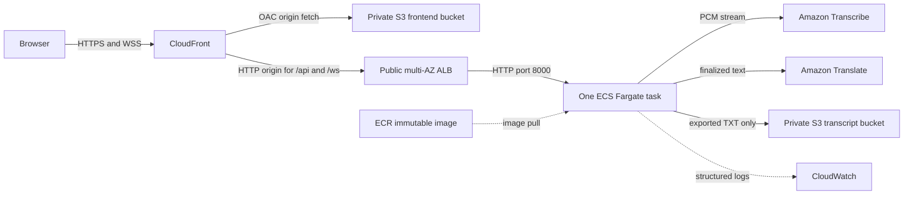

# LiveCap

[](https://github.com/9ducanh9/livecap/actions/workflows/ci.yml)
[](https://github.com/9ducanh9/livecap/releases/latest)

LiveCap is a real-time Vietnamese-English meeting caption application. It
captures microphone audio in the browser, streams 16 kHz PCM over a secure
WebSocket, transcribes speech with Amazon Transcribe, translates finalized text
with Amazon Translate, and displays bilingual captions side by side.

- [Live demo](https://dpeohr327wt9l.cloudfront.net)
- [Latest release](https://github.com/9ducanh9/livecap/releases/latest)
- [Three-minute demo guide](docs/demo-guide.md)
- [Verified as-deployed architecture](docs/as-deployed-architecture.md)

## Product Preview

### Landing Page


### Caption Dashboard

This screenshot was captured from the production UI while a fake microphone
WAV passed through the complete WebSocket, Transcribe, and Translate path.


## Core Capabilities

- Real-time English and Vietnamese transcription through parallel Transcribe
  streams.
- Finalized bilingual caption rows with speaker label and timestamps.
- Browser microphone capture with 16 kHz, 16-bit, mono PCM output.
- WebSocket heartbeat and three bounded reconnect attempts using 1, 2, and 4
  second backoff.
- Process-local global and per-IP session limits.
- Thirty-minute session limit with automatic stop.
- TXT transcript export to private S3 through a time-limited presigned URL.
- No raw audio storage.

## Verified Submission Baseline

The `v1.5.2` release was verified on 2026-07-04:

| Area | Evidence |
|---|---|
| Backend | 204 tests pass on Python 3.11 |
| Frontend | 11 tests pass and Vite production build succeeds |
| Terraform | Formatting, `init -backend=false`, and validation pass |
| Secret hygiene | Gitleaks passes; no tracked tfstate, tfvars, or real `.env` files |
| GitHub | Dependabot enabled with zero open alerts at release time |
| Live backend | ECS task definition `livecap-backend-dev:5`, desired/running `1/1` |
| Container | Immutable ECR image `1ef4250-amd64` |
| Production flow | Health, WSS, transcription, translation, heartbeat, stop, export, and download pass |
| Retention | Transcript objects and backend logs: 14 days |

## Architecture

### Current Live Environment



CloudFront terminates viewer HTTPS/WSS. The current ALB spans public subnets in
`ap-southeast-1a` and `ap-southeast-1b`; one Fargate task can be placed in
either subnet with a public IP. CloudFront currently connects to the ALB over
HTTP. WAF, wake-on-demand, private task networking, and scale-to-zero are not
claimed as deployed.

See [As-Deployed Architecture](docs/as-deployed-architecture.md) for resource
placement, request/response paths, availability behavior, and verified current
state.

### Reviewed Target Architecture

The Terraform target adds a dedicated two-AZ VPC, private Fargate subnets, one
NAT Gateway, WAF Web ACLs in COUNT mode, an IAM-protected wake Lambda, ECS
`0 <-> 1` idle scaling, a CloudWatch dashboard, and an AWS Budget. It remains
behind state import, plan review, and blue/green cutover gates.


## Technology Stack

| Layer | Technology |
|---|---|
| Frontend | React 18, TypeScript, Vite, Tailwind CSS, GSAP |
| Backend | Python 3.11, FastAPI, Uvicorn, WebSocket |
| AI services | Amazon Transcribe Streaming, Amazon Translate |
| Compute | Amazon ECS Fargate behind an Application Load Balancer |
| Edge and storage | CloudFront, private S3 frontend and transcript buckets |
| Delivery | Docker, Amazon ECR, Terraform, GitHub Actions |
| Operations | CloudWatch logs/metrics, ECR scanning, Dependabot, Gitleaks |

## Repository Layout

```text
livecap/
|-- backend/                  # FastAPI application and 204 tests
|-- frontend/                 # React application and 11 tests
|-- infrastructure/
|   |-- bootstrap/            # Remote-state S3 bootstrap
|   `-- terraform/            # Current and target AWS infrastructure
|-- docs/                     # Architecture, demo, design, and screenshots
|-- .github/workflows/ci.yml  # Test, build, Terraform, and secret gates
`-- README.md
```

## Local Development

### Prerequisites

- Python 3.11+
- Node.js 20 and npm
- AWS credentials supplied by an AWS profile or role when testing real
  Transcribe, Translate, or S3 calls

Do not place AWS access keys in `.env` files.

### Backend

```powershell
cd backend
python -m venv .venv
.\.venv\Scripts\Activate.ps1
python -m pip install -r requirements-dev.txt
Copy-Item .env.example .env
python -m uvicorn app.main:app --reload --host 0.0.0.0 --port 8000
```

Health endpoint: `http://127.0.0.1:8000/api/health`

### Frontend

```powershell
cd frontend
npm ci
Copy-Item .env.example .env
npm run dev
```

Open `http://127.0.0.1:5173`.

## Configuration

- Backend settings: [`backend/.env.example`](backend/.env.example)
- Frontend settings: [`frontend/.env.example`](frontend/.env.example)
- Terraform inputs:
  [`infrastructure/terraform/terraform.tfvars.example`](infrastructure/terraform/terraform.tfvars.example)
- Remote backend example:
  [`infrastructure/terraform/backend.hcl.example`](infrastructure/terraform/backend.hcl.example)

Real `.env`, `terraform.tfvars`, `backend.hcl`, state, plan, and crash files are
ignored and must remain untracked.

## Verification

### Backend

```powershell
cd backend
python -m compileall app
python -m pytest
```

### Frontend

```powershell
cd frontend
npm ci
npm test
npm run build
```

### Terraform Syntax Only

```powershell
terraform -chdir=infrastructure/bootstrap/remote-state init -backend=false
terraform -chdir=infrastructure/bootstrap/remote-state validate
terraform -chdir=infrastructure/terraform init -backend=false
terraform -chdir=infrastructure/terraform fmt -check
terraform -chdir=infrastructure/terraform validate
```

These commands do not apply infrastructure or migrate state.

## Deployment Safety

The current AWS environment predates the complete Terraform state. Never apply
the main stack from empty or incomplete state.

Before any infrastructure change:

1. Use [`infrastructure/terraform/IMPORT_PLAN.md`](infrastructure/terraform/IMPORT_PLAN.md)
   to reconcile existing resources into reviewed remote state.
2. Push the backend image under an immutable Git SHA-derived tag.
3. Run and review a full Terraform plan.
4. Use a parallel target stack and blue/green cutover.
5. Never run `terraform destroy` or state migration from CI.

The authoritative infrastructure workflow is
[`infrastructure/terraform/README.md`](infrastructure/terraform/README.md).

## Security and Cost Boundaries

- IAM roles provide AWS access; no credentials are embedded in application
  code or container images.
- Frontend and transcript buckets are private and independently scoped.
- Transcript downloads expire, and transcript objects are removed after 14
  days.
- Session duration and concurrent-session guards bound Transcribe/Translate
  abuse.
- ECS scale-to-zero exists in the reviewed target, but the live service remains
  at one task for submission stability.
- ALB, NAT Gateway, and WAF retain fixed or baseline cost while provisioned;
  Transcribe and Translate are usage-based.
- ECR scanning reports inherited Debian base-package findings that remain
  tracked until compatible upstream fixes are available.

## Documentation

- [Documentation index](docs/README.md)
- [Demo guide](docs/demo-guide.md)
- [As-deployed architecture](docs/as-deployed-architecture.md)
- [Requirements, design, and runtime flows](docs/post-v1.5-requirements-design-flow.md)
- [Infrastructure overview](infrastructure/README.md)
- [Terraform source of truth](infrastructure/terraform/README.md)
- [Terraform import plan](infrastructure/terraform/IMPORT_PLAN.md)

## License

This repository is an academic project. No open-source license has been
assigned.
