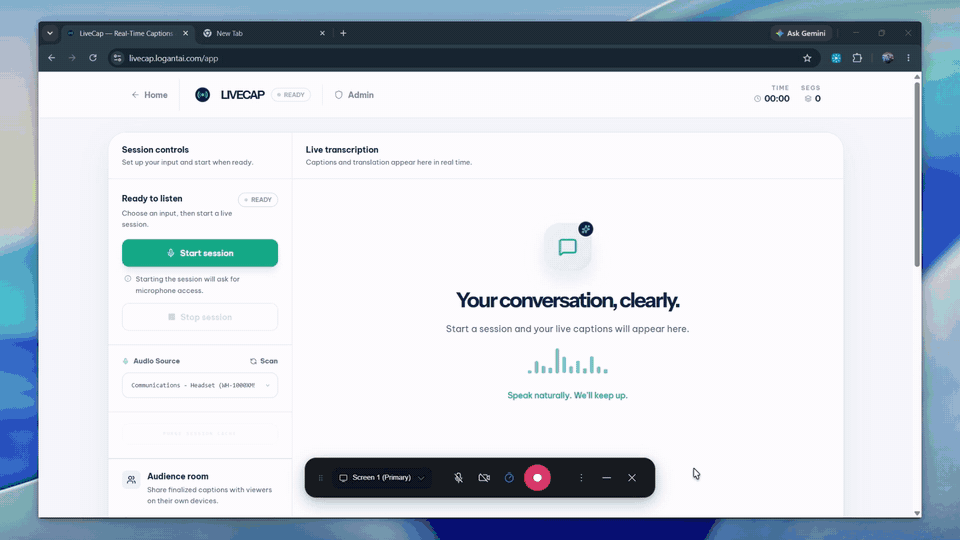

<h1 align="center">LiveCap</h1>

English · <a href="README.vi.md">Tiếng Việt</a>

Live bilingual captions. A shared room. A transcript to keep.

  <a href="https://livecap.logantai.com/app">Open the app</a> ·
  <a href="docs/as-deployed-architecture.md">Architecture</a> ·
  <a href="docs/benchmark-phase5-results.md">Measured benchmark</a> ·
  <a href="docs/README.md">Documentation</a>

  
  
  

LiveCap turns spoken Vietnamese and English into live bilingual captions. A host
can share an audience room so viewers can follow finalized captions on their own
devices, then keep a transcript after the session.

[Higher-resolution demo](docs/livecap-demo.gif)

## What it does

| Bilingual captions | Audience rooms | Transcript export |
|---|---|---|
| Turn microphone or shared-tab audio into live Vietnamese and English captions. | Share a link, code or QR so viewers can follow finalized captions on their devices. | Keep a private TXT transcript after the conversation ends. |

This is a UI demonstration; the linked benchmark report used a separate
recorded-audio fixture.

## How it works

The browser streams audio over WebSocket; Transcribe and Translate produce the
bilingual captions, which return through the same connection. Cognito handles
sign-in, while a wake Lambda starts the backend after idle scale-to-zero.
**Raw audio is not stored.**

See the [as-deployed architecture](docs/as-deployed-architecture.md) for the
request path and security boundaries.

## Run locally

The frontend uses React, TypeScript, and Vite; the backend uses Python and
FastAPI. Follow the [local run guide](docs/run-local.md) for setup and required
AWS configuration. Browse the [documentation index](docs/README.md) for the
demo guide, architecture, and operational notes.
