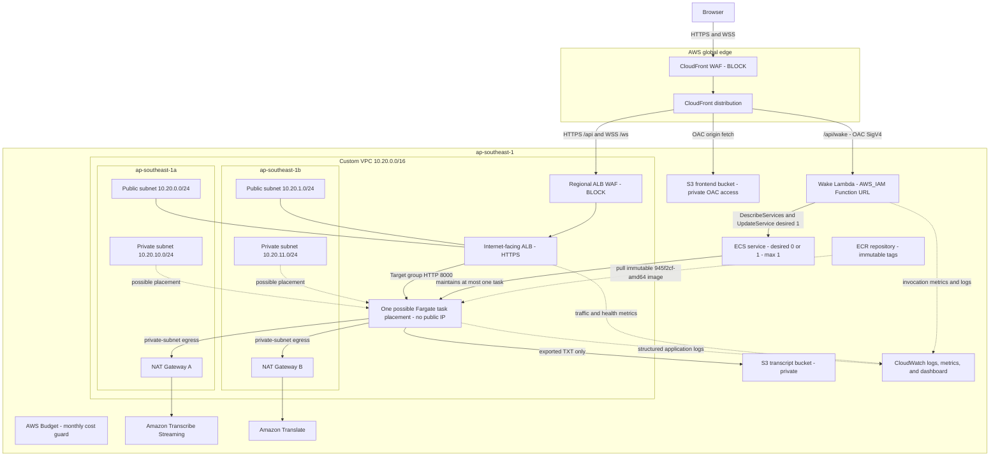

# LiveCap As-Deployed Architecture

This document describes the AWS environment serving the public LiveCap site at
[livecap.logantai.com](https://livecap.logantai.com/).

Originally verified 2026-07-14 in `ap-southeast-1`; the "Verified Current
State" table below was refreshed 2026-07-24 against live AWS (not just
Terraform config) after several rounds of feature work (Cognito auth-by-
default, usage quotas, Stripe billing, admin panel). CloudFront and its WAF
are global; the CloudFront WAF is managed through the required `us-east-1`
provider scope.

## Resource Topology

Only one Fargate task runs at a time. ECS may place it in either configured
private subnet and replaces it after failure. This is self-healing rather than
active-active high availability; an in-flight WebSocket session is lost during
task replacement.

## Runtime Flows

### Frontend

1. The browser requests `/` over HTTPS from CloudFront.
2. CloudFront WAF evaluates blocking managed rules and the rate-based rule.
3. A viewer-request CloudFront Function rewrites extensionless React routes
   such as `/app` to `/index.html` without rewriting API or WAF errors.
4. CloudFront fetches private React/Vite assets from S3 through Origin Access
   Control and caches static assets at edge locations.

### Wake and Health

1. The user selects **Start session**.
2. The browser posts to same-origin `/api/wake` through CloudFront.
3. CloudFront signs the origin request with Lambda OAC. The Function URL uses
   `AWS_IAM`, so direct public invocation is denied.
4. Lambda reads the target ECS service and calls `UpdateService(desiredCount=1)`
   only when needed.
5. The frontend polls `/api/health` through CloudFront and the ALB until the
   target is healthy, then opens the WebSocket.

### Live Caption Session

1. The browser opens `/ws/transcribe` through CloudFront using WSS.
2. CloudFront forwards the upgraded request over HTTPS through the regional ALB
   WAF to the multi-AZ ALB.
3. The ALB sends traffic only to a healthy Fargate target on port 8000.
4. The browser streams 16 kHz, 16-bit, mono PCM chunks.
5. FastAPI streams audio to Amazon Transcribe and sends finalized text to
   Amazon Translate.
6. Finalized bilingual segments return over the same path:
   Fargate -> ALB -> CloudFront -> browser.

### Idle Scale-Down

1. When the final active WebSocket session ends, the backend starts a 300-second
   grace timer.
2. A new session cancels the pending timer.
3. If the registry remains empty, the backend calls ECS
   `UpdateService(desiredCount=0)`.

### Transcript Export

1. The browser posts finalized segments to `/api/sessions/{session_id}/export`.
2. The backend serializes the transcript and stores the TXT object in the
   private transcript bucket.
3. The backend returns a time-limited presigned download URL and the browser
   starts the download.
4. Raw microphone audio is never stored.

## Verified Current State

| Area | Current deployment |
|---|---|
| Public entrypoint | `https://livecap.logantai.com/` through CloudFront |
| Static frontend | Private S3 bucket through CloudFront OAC |
| Backend entrypoint | CloudFront `/api/*` and `/ws/*` -> HTTPS target ALB |
| VPC | Dedicated `10.20.0.0/16` VPC across `ap-southeast-1a` and `ap-southeast-1b` |
| ALB placement | Two public subnets; ingress restricted to the CloudFront origin-facing prefix list |
| Task networking | Two private subnets; `assign_public_ip=false` |
| NAT Gateways | Two (one per AZ); multi-AZ egress, no single-AZ dependency |
| ECS capacity | Desired 0–1 (`backend_max_capacity=1`); a shared DynamoDB session registry is already live as the precondition for raising this, see `docs/multi-task-runbook.md` |
| Backend image | `945f2cf-amd64` (immutable Git-SHA ECR tag), task definition `livecap-target-backend-dev:27` |
| Authentication | Amazon Cognito User Pool (email + Google OAuth); custom login UI; **enforced by default** (`ENABLE_AUTH=true`) |
| AI/ML services | Transcribe Streaming (+ custom vocabulary), Translate, Bedrock (Claude meeting notes), Polly (TTS), Comprehend (sentiment/keywords) |
| Session store | DynamoDB `livecap-sessions-dev` (shared across tasks, TTL) |
| Transcript history | DynamoDB `livecap-transcript-history-dev` (per-user, TTL 14 days) |
| Usage quota | DynamoDB `livecap-usage-dev` (per-user monthly sessions/minutes; tiers: free, pro, business, unlimited) |
| Billing | Stripe subscription checkout + customer portal (test mode); Pro/Business Price IDs live; promo codes enabled on Checkout |
| Admin dashboard | `/admin` — user management, usage analytics, revenue, system health; gated on Cognito group `admin`; audit log (`livecap-admin-audit-dev`) for mutating actions |
| Wake endpoint | IAM-protected Lambda Function URL reached through CloudFront OAC |
| WAF | Separate blocking Web ACLs for CloudFront and the ALB |
| Transcript storage | Private S3, 14-day retention, no raw audio storage |
| Observability | CloudWatch logs + metrics + dashboard, Container Insights, X-Ray tracing (sidecar), alarms → SNS topic |
| Security detection | VPC Flow Logs (ALL traffic), Amazon GuardDuty (HIGH → SNS), AWS Security Hub (Foundational Best Practices) |
| Cost guard | AWS Budget $50/month |
| CI | Backend, Frontend, Terraform, and Secret scan jobs pass; CI does not deploy |
| CD | Full deploy pipeline on push to main: CI gate → build image → Terraform plan+apply → ECS wait stable → health check (auto-rollback on failure) → frontend S3 sync → CloudFront invalidation |

## AWS Well-Architected Framework Alignment

**Operational Excellence** — The entire environment is defined in Terraform;
every change goes through a reviewed `plan` before `apply`, and no component is
deployed by hand. Backend images use immutable Git-SHA tags in ECR, so a
rollback is a pointer change rather than a rebuild. A full CD pipeline on push
to main runs CI tests, builds and pushes the image, applies Terraform, waits
for ECS stability, health-checks the deployment, and auto-rolls back on
failure. CloudWatch Logs, a dashboard, Container Insights, and X-Ray tracing
back day-to-day operation, and ten CloudWatch alarms notify an SNS topic. New
capabilities ship behind Terraform-controlled feature flags that default to
off.

**Security** — Two independent WAF layers (CloudFront and the regional ALB)
enforce managed block rules and rate limiting, backed by GuardDuty, Security
Hub, and VPC Flow Logs. The Fargate task runs in a private subnet with no
public IP; the ALB only accepts HTTPS from the CloudFront origin-facing prefix
list, and the task only accepts traffic from the ALB. Both S3 buckets (frontend
and transcripts) block public access and are reached only through CloudFront
Origin Access Control; the wake Lambda Function URL requires `AWS_IAM`.
Authentication is Amazon Cognito (email and Google OAuth, PKCE, no client
secret in the browser); the admin dashboard is gated on Cognito group
membership and fails closed on any authorization error. Stripe keys live in
Secrets Manager and are injected through the task execution role, never in the
image or a plaintext environment variable. Raw microphone audio is never
stored.

**Reliability** — The VPC spans two Availability Zones with independent public
and private subnets and two NAT Gateways, so outbound access does not depend on
a single AZ. ECS replaces a failed task automatically and the ALB routes only
to healthy targets. A shared DynamoDB session registry (rather than in-process
state) is already live as the precondition for running more than one backend
task. The service is currently capped at one task by design; this is
self-healing rather than active-active availability, and an in-flight
WebSocket session is lost during task replacement until that cap is raised.

**Performance Efficiency** — Transcription, translation, text-to-speech, and
sentiment analysis all run on managed, auto-scaling AWS services rather than
self-hosted infrastructure. CloudFront caches static assets at the edge. ECS
Application Auto Scaling tracks CPU and memory, and the service scales to zero
when idle. Graviton (arm64) is available as a lower-cost, better performance-
per-watt compute option once adopted.

**Cost Optimization** — The backend scales to zero after five minutes of
inactivity and wakes on demand, which removes the largest source of idle cost.
DynamoDB uses on-demand billing with TTL cleanup on session, history, and usage
data. An AWS Budget with a $50 monthly threshold provides a cost guard, and
Cost Explorer backs the admin dashboard's cost visibility. The ALB, NAT
Gateways, and WAF are the deliberate fixed-cost floor that remains even while
compute is at zero.

**Sustainability** — Scaling compute to zero when idle and running managed,
multi-tenant AWS services instead of dedicated infrastructure both reduce
energy use relative to always-on, self-hosted alternatives. Graviton, when
adopted, offers better performance per watt than the current x86 baseline.

## Security Boundaries

- The frontend and transcript S3 buckets block public access.
- CloudFront OAC is used for both the S3 frontend origin and the wake Lambda
  origin.
- The ALB security group accepts HTTPS only from the AWS-managed CloudFront
  origin-facing prefix list.
- The task security group accepts port 8000 only from the ALB security group.
- The wake Lambda role is limited to `ecs:DescribeServices` and
  `ecs:UpdateService` for the target ECS service, plus basic Lambda logging.
- Runtime AWS access uses ECS task and execution roles; credentials are not
  stored in the frontend or container image.

## Known Boundaries

- A maximum of one task (`backend_max_capacity=1`) preserves correctness and
  does not provide active-active availability, even though the DynamoDB
  session registry needed to safely raise it is already live.
- ALB, NAT Gateway, and WAF retain baseline cost while ECS is at zero.
- Container Insights is intentionally disabled for cost control; the dashboard
  uses standard ECS metrics.
- The direct Watchtower `livecap` log group needs an explicit retention policy,
  and the budget needs a notification subscriber before either can be treated
  as a complete production guardrail.
- The legacy ALB/ECS rollback stack was retired after the migration validation.
  Any remaining legacy EC2, storage, or IAM resource is outside the request path
  and must be separately inventoried before deletion.
- ECR operating-system package findings must be reviewed during every base-image
  rebuild before commercial production release.
