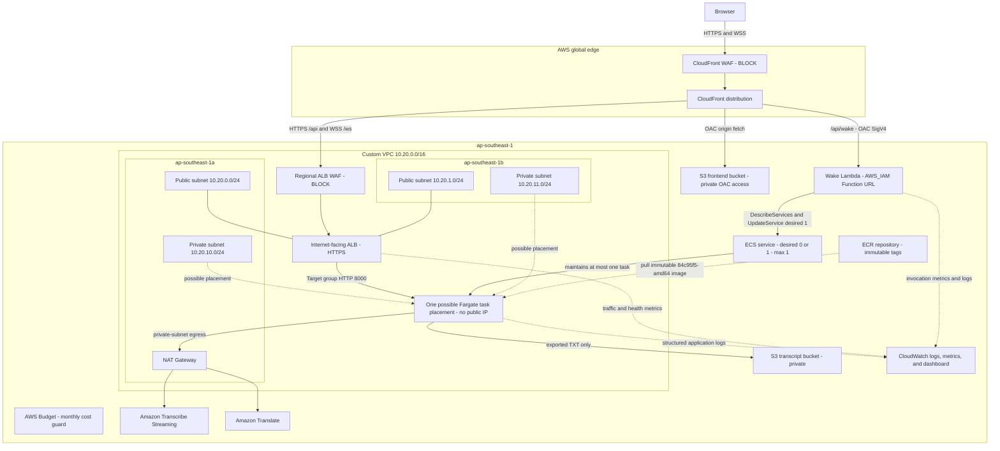

# LiveCap As-Deployed Architecture

This document describes the AWS environment serving the public LiveCap site at
[livecap.logantai.com](https://livecap.logantai.com/).

Verified on 2026-07-14 in `ap-southeast-1`. CloudFront and its WAF are global;
the CloudFront WAF is managed through the required `us-east-1` provider scope.

## Resource Topology

Only one Fargate task runs at a time. ECS may place it in either configured
private subnet and replaces it after failure. This is self-healing rather than
active-active high availability; an in-flight WebSocket session is lost during
task replacement.

## Runtime Flows

### Frontend

1. The browser requests `/` over HTTPS from CloudFront.
2. CloudFront WAF evaluates blocking managed rules and the rate-based rule.
3. A viewer-request CloudFront Function rewrites extensionless React routes
   such as `/app` to `/index.html` without rewriting API or WAF errors.
4. CloudFront fetches private React/Vite assets from S3 through Origin Access
   Control and caches static assets at edge locations.

### Wake and Health

1. The user selects **Start session**.
2. The browser posts to same-origin `/api/wake` through CloudFront.
3. CloudFront signs the origin request with Lambda OAC. The Function URL uses
   `AWS_IAM`, so direct public invocation is denied.
4. Lambda reads the target ECS service and calls `UpdateService(desiredCount=1)`
   only when needed.
5. The frontend polls `/api/health` through CloudFront and the ALB until the
   target is healthy, then opens the WebSocket.

### Live Caption Session

1. The browser opens `/ws/transcribe` through CloudFront using WSS.
2. CloudFront forwards the upgraded request over HTTPS through the regional ALB
   WAF to the multi-AZ ALB.
3. The ALB sends traffic only to a healthy Fargate target on port 8000.
4. The browser streams 16 kHz, 16-bit, mono PCM chunks.
5. FastAPI streams audio to Amazon Transcribe and sends finalized text to
   Amazon Translate.
6. Finalized bilingual segments return over the same path:
   Fargate -> ALB -> CloudFront -> browser.

### Idle Scale-Down

1. When the final active WebSocket session ends, the backend starts a 300-second
   grace timer.
2. A new session cancels the pending timer.
3. If the registry remains empty, the backend calls ECS
   `UpdateService(desiredCount=0)`.

### Transcript Export

1. The browser posts finalized segments to `/api/sessions/{session_id}/export`.
2. The backend serializes the transcript and stores the TXT object in the
   private transcript bucket.
3. The backend returns a time-limited presigned download URL and the browser
   starts the download.
4. Raw microphone audio is never stored.

## Verified Current State

| Area | Current deployment |
|---|---|
| Public entrypoint | `https://livecap.logantai.com/` through CloudFront |
| Static frontend | Private S3 bucket through CloudFront OAC |
| Backend entrypoint | CloudFront `/api/*` and `/ws/*` -> HTTPS target ALB |
| VPC | Dedicated `10.20.0.0/16` VPC across `ap-southeast-1a` and `ap-southeast-1b` |
| ALB placement | Two public subnets; ingress restricted to the CloudFront origin-facing prefix list |
| Task networking | Two private subnets; `assign_public_ip=false` |
| ECS capacity | Desired count changes `0 <-> 1`; maximum capacity is 1 |
| Backend task definition | Terraform-managed target revision; inspect the running ECS service for the current revision |
| Backend image | Immutable Git-SHA-derived ECR tag; inspect the running task definition for the current tag |
| Wake endpoint | IAM-protected Lambda Function URL reached through CloudFront OAC |
| WAF | Separate blocking Web ACLs for CloudFront and the ALB |
| Transcript storage | Private S3, 14-day retention, no raw audio storage |
| Observability | CloudWatch logs, metrics, dashboard, and WAF logs; Terraform-managed log groups use 14-day retention, while the direct Watchtower group still needs a policy |
| Cost guard | AWS Budget with a `$50` monthly threshold; no notification subscriber is currently configured and billing data is not real time |
| CI | Backend, Frontend, Terraform, and Secret scan jobs pass; CI does not deploy |

## Security Boundaries

- The frontend and transcript S3 buckets block public access.
- CloudFront OAC is used for both the S3 frontend origin and the wake Lambda
  origin.
- The ALB security group accepts HTTPS only from the AWS-managed CloudFront
  origin-facing prefix list.
- The task security group accepts port 8000 only from the ALB security group.
- The wake Lambda role is limited to `ecs:DescribeServices` and
  `ecs:UpdateService` for the target ECS service, plus basic Lambda logging.
- Runtime AWS access uses ECS task and execution roles; credentials are not
  stored in the frontend or container image.

## Known Boundaries

- One NAT Gateway in `ap-southeast-1a` is a cost-sensitive single-AZ dependency
  for private task egress.
- A maximum of one task preserves correctness for the in-memory active-session
  registry but does not provide active-active availability.
- ALB, NAT Gateway, and WAF retain baseline cost while ECS is at zero.
- Container Insights is intentionally disabled for cost control; the dashboard
  uses standard ECS metrics.
- The direct Watchtower `livecap` log group needs an explicit retention policy,
  and the budget needs a notification subscriber before either can be treated
  as a complete production guardrail.
- The legacy ALB/ECS rollback stack was retired after the migration validation.
  Any remaining legacy EC2, storage, or IAM resource is outside the request path
  and must be separately inventoried before deletion.
- ECR operating-system package findings must be reviewed during every base-image
  rebuild before commercial production release.
