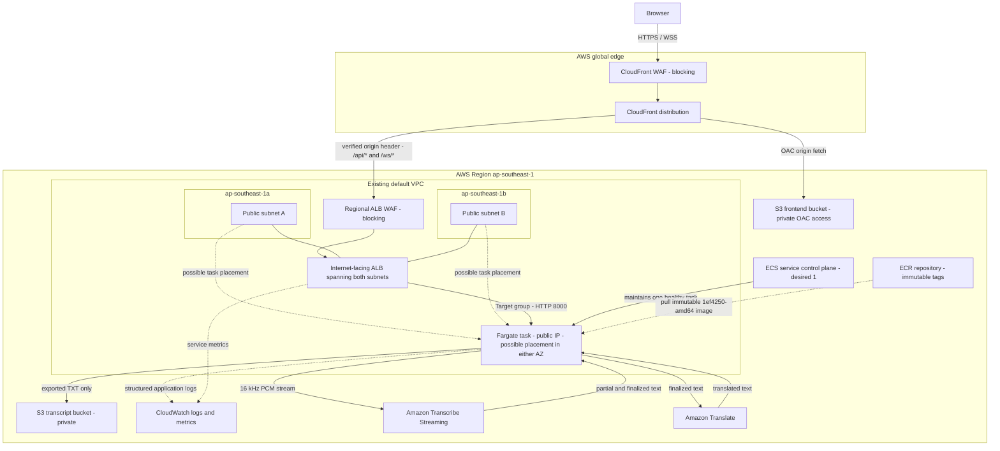

# LiveCap As-Deployed Architecture

This document describes the AWS environment serving the public LiveCap demo.
It is intentionally separate from the reviewed target architecture so that
planned controls are not presented as already deployed.

Verified on 2026-07-07 in `ap-southeast-1`.

## Resource Topology

The single task is not duplicated across both Availability Zones. ECS can place
the one desired task in either configured public subnet and replaces it if it
fails. This provides self-healing, not active-active high availability; an
in-flight WebSocket session is lost during task replacement.

## Runtime Flows

### Frontend

1. The browser requests `/` over HTTPS from CloudFront.
2. A viewer-request CloudFront Function rewrites extensionless React routes
   such as `/app` to `/index.html` without masking WAF or API errors.
3. CloudFront fetches the private React/Vite assets from S3 through Origin
   Access Control and caches static assets at edge locations.

### Live Caption Session

1. The browser opens `/ws/transcribe` through CloudFront using WSS.
2. CloudFront adds the private origin verification header and forwards the
   upgraded request through the regional ALB WAF over the current HTTP origin
   connection.
3. The ALB sends traffic only to the healthy Fargate target on port 8000.
4. The browser streams 16 kHz, 16-bit, mono PCM chunks.
5. FastAPI streams audio to Amazon Transcribe and sends finalized text to
   Amazon Translate.
6. Finalized bilingual segments return over the same WebSocket path:
   Fargate -> ALB -> CloudFront -> browser.

### Transcript Export

1. The browser posts finalized segments to `/api/sessions/{session_id}/export`.
2. The backend serializes the transcript and stores the TXT object in the
   private transcript bucket.
3. The backend returns a time-limited presigned download URL.
4. Raw microphone audio is never stored.

## Verified Current State

| Area | Current deployment |
|---|---|
| Frontend entrypoint | CloudFront HTTPS |
| Backend entrypoint | CloudFront `/api/*` and `/ws/*` -> public ALB |
| ALB placement | Public subnets in `ap-southeast-1a` and `ap-southeast-1b` |
| Backend compute | One healthy ECS Fargate task, task definition revision 5 |
| Task networking | Default VPC public subnets, public IP enabled |
| Backend image | Immutable `1ef4250-amd64` ECR tag |
| Viewer TLS | Terminates at CloudFront |
| CloudFront to ALB | HTTP origin |
| Origin TLS prerequisite | ACM certificate for `api.livecap.logantai.com` requested in `ap-southeast-1`; pending external DNS validation |
| WAF | Blocking Web ACLs associated with CloudFront and ALB; BLOCK/COUNT logs retained for 14 days with sensitive headers redacted |
| ALB ingress | Port 80 restricted to the AWS-managed CloudFront origin-facing prefix list; direct requests are denied by security group and ALB WAF |
| Wake and scale-to-zero | Not deployed; desired count remains 1 |
| Transcript retention | 14 days; no raw audio storage |
| CloudWatch log retention | 14 days |

## Target Delta

The Terraform target introduces a dedicated two-AZ VPC, private Fargate
subnets, one NAT Gateway, `assign_public_ip=false`,
CloudFront-authenticated wake Lambda, ECS `0 <-> 1` idle scaling, a CloudWatch
dashboard, and an AWS Budget. These resources require state import, plan review,
and a blue/green cutover before they can be described as deployed.
