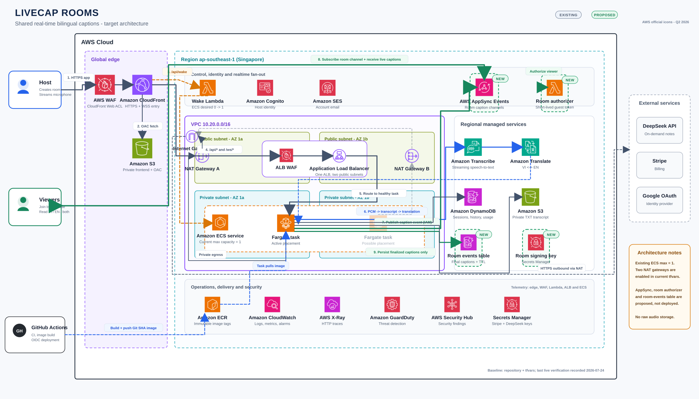

# LiveCap Rooms - Huong phat trien san pham de xuat

## 1. Ket luan ngan

Huong phat trien phu hop nhat cho LiveCap luc nay la **LiveCap Rooms**:

> Mot nguoi host thu am cuoc hop, lop hoc hoac workshop. Nhung nguoi tham gia
> quet QR hay mo link de xem phu de Viet-Anh theo thoi gian thuc tren thiet bi
> cua rieng ho, khong can cai ung dung va khong can bat micro.

Huong nay tan dung truc tiep pipeline LiveCap da co thay vi them mot tinh nang AI
roi rac. Transcribe, Translate, ECS Fargate, Cognito, DynamoDB, S3, CloudFront,
WAF va luong wake `0 -> 1` van duoc giu nguyen. Thanh phan moi quan trong nhat
la **AWS AppSync Events** de phat caption toi nhieu nguoi xem bang WebSocket ma
khong bat ECS tu quan ly hang tram ket noi viewer.

AppSync Events va authorizer trong so do la kien truc muc tieu, **chua phai
trang thai da deploy**. Vertical slice hien tai van fan-out viewer truc tiep tu
mot ECS process.

### Trang thai prototype

Nhanh `feature/livecap-rooms` da co mot vertical slice chay local de danh gia
trai nghiem truoc khi tao tai nguyen AWS moi:

- Host tao/khoa room, nhan QR, link viewer va ma sau ky tu.
- Viewer vao `/rooms/{room_code}`, chon VI, EN hoac song ngu.
- Backend phat chi caption finalized, giu snapshot cho late join va gioi han
  retry/heartbeat o viewer.
- Room metadata va finalized captions co the luu trong DynamoDB khi
  `ROOM_TABLE_NAME` duoc cau hinh. Local/dev khong co bien nay van dung
  process-local store de khong phu thuoc AWS.
- Viewer fan-out van in-memory trong mot backend process va duoc bao ve boi
  feature flag mac dinh OFF. AppSync Events, Lambda authorizer va signing key
  van la kien truc de xuat, **chua deploy**.
- Terraform da chuan bi table pay-per-request + TTL va IAM chi cho ECS task
  `GetItem`, `PutItem`, `UpdateItem`, `Query`; batch nay chua apply AWS.

## 2. Van de thuc te can giai quyet

LiveCap hien giai quyet tot bai toan "nguoi dang mo app xem caption cua chinh
phien do". Trong mot tinh huong that, caption lai can den nhieu nguoi hon:

1. **Chi mot man hinh thay caption.** Nguoi ngoi xa man hinh, nguoi dung dien
   thoai hoac nguoi tham gia tu xa khong co trai nghiem doc tot.
2. **Moi nguoi co nhu cau ngon ngu khac nhau.** Mot nguoi chi can tieng Viet,
   mot nguoi chi can tieng Anh, nguoi khac muon xem song ngu.
3. **Nguoi vao tre bi mat ngu canh.** Caption live khong tu giai quyet phan noi
   dung da dien ra truoc khi ho tham gia.
4. **Host khong nen chia se quyen micro hay dashboard quan tri.** Viewer chi can
   quyen doc caption cua dung room.
5. **Fan-out truc tiep tu mot task ECS khong scale tot.** Neu moi viewer mo mot
   WebSocket vao backend hien tai, task vua xu ly audio/AI vua giu toan bo ket
   noi viewer; viec deploy, thay task hoac scale se lam gian doan ca phong.

Caption dong bo con la mot nhu cau accessibility thuc te: W3C xem live text
caption la cach lam noi dung am thanh truc tiep co the tiep can duoc. LiveCap
Rooms mo rong gia tri nay cho workshop, lop hoc, buoi onboarding va cuoc hop
song ngu, khong chi cho nguoi dang cam may thu am.

## 3. Nhom nguoi dung dau tien

### Nhom uu tien

- Workshop/bootcamp Viet-Anh co mot dien gia va nhieu nguoi nghe.
- Lop hoc co sinh vien quoc te hoac nguoi khiem thinh/nghe kem.
- Buoi onboarding, town hall, demo san pham va ho tro khach hang song ngu.
- Phong hop nho noi mot laptop thu am nhung moi nguoi muon doc tren dien thoai.

### Khong nen mo rong ngay

- Khong tich hop truc tiep Zoom/Teams/Meet trong batch dau.
- Khong luu raw audio.
- Khong tu dong tao AI notes/keywords cho moi phien; giu nut tao meeting notes
  theo yeu cau nhu hien tai.
- Khong tach thanh microservices hoac chuyen sang EKS khi chua co tai that.

## 4. Trai nghiem nguoi dung muc tieu

### Host

1. Dang nhap bang Cognito.
2. Chon **Create room** va nhan QR + ma tham gia ngan.
3. Bam **Start session**; luong wake hien tai dua ECS tu `0 -> 1`.
4. Trinh duyet chi bat dau thu am sau khi health check thanh cong.
5. Host thay caption, so viewer, trang thai ket noi va co the khoa room.
6. Khi dung, host co the export TXT va chu dong tao meeting notes.

### Viewer

1. Quet QR hoac nhap ma room, khong can cap quyen micro.
2. Chon `VI`, `EN` hoac `Bilingual`.
3. Nhan caption live tren dien thoai qua mot kenh chi-doc.
4. Neu vao tre, nhan lai mot cua so caption da finalized gan nhat.
5. Khi mat mang ngan, client reconnect va tiep tuc tu sequence tiep theo.

### Y nghia QR, link va ma room

- QR, viewer link va ma sau ky tu la ba cach mo **cung mot viewer page**.
- Ma room khong phai token wake 5 phut. No la public capability locator: ai co
  ma/link deu co the doc finalized captions cua room trong thoi gian retention.
- Host token rieng moi co quyen dong room; backend chi luu SHA-256 hash cua token,
  khong luu plaintext token trong DynamoDB.
- Room live toi da 4 gio theo mac dinh. Sau khi host Stop, room chuyen sang
  `ended`; archive expiry la live expiry + 14 ngay, nen transcript co it nhat
  du 14 ngay de doc sau khi room ket thuc.
- Grace scale-down 300 giay chi dieu khien vong doi compute ECS. ECS ve 0 khong
  lam ma room hay transcript het han khi DynamoDB store duoc cau hinh.

## 5. Kien truc de xuat

### Tai nguyen hien co duoc giu lai

- CloudFront + CloudFront WAF lam public entry point.
- S3 frontend private qua OAC.
- Wake Lambda chi co quyen `ecs:DescribeServices` va `ecs:UpdateService`.
- ALB multi-AZ + Regional WAF.
- ECS Fargate trong hai private subnet, khong public IP.
- Hai NAT Gateway theo cau hinh repository hien tai.
- Amazon Transcribe Streaming + Amazon Translate.
- Cognito, DynamoDB, transcript S3, CloudWatch/X-Ray, ECR va GitHub Actions.
- DeepSeek va Stripe la dich vu ngoai AWS, chi duoc goi khi tinh nang tuong ung
  duoc bat.

### Tai nguyen moi

| Thanh phan | Vai tro | Ly do khong dat trong ECS |
|---|---|---|
| AWS AppSync Events | Pub/sub caption theo channel cua room | Quan ly ket noi WebSocket va fan-out doc lap voi task xu ly audio |
| Lambda room authorizer | Xac minh token tham gia ngan han va khoa viewer vao dung room | Khong trao Cognito account hay quyen publish cho guest |
| DynamoDB room-events | Room metadata, sequence va caption finalized; TTL tu dong | Da co implementation/Terraform trong preview; can apply de song sot qua ECS scale-to-zero |
| Secrets Manager room signing key | Bi mat ky token tham gia | Khong hardcode trong frontend/container image |

### Quyen truy cap AppSync

- **Publish:** chi ECS task role, dung IAM, vao channel
  `/rooms/{room_id}/captions`.
- **Subscribe:** viewer dung token ngan han, duoc Lambda authorizer gioi han vao
  dung `room_id`.
- **Host:** Cognito token tao/khoa room qua REST API hien tai.
- Viewer khong co quyen publish, khong doc DynamoDB truc tiep va khong vao
  WebSocket audio `/ws/transcribe`.

## 6. Luong ky thuat

### A. Mo app va wake backend

1. Browser tai React/Vite tu CloudFront va S3 qua OAC.
2. Host bam Start; CloudFront route `/api/wake` den Wake Lambda.
3. Lambda goi ECS `UpdateService(desiredCount=1)`.
4. Frontend poll `/api/health`; khi ALB co target healthy moi bat micro.

### B. Audio den caption

1. Host gui PCM audio bang WSS:
   `CloudFront -> ALB WAF -> ALB -> ECS Fargate`.
2. Fargate stream audio den Amazon Transcribe.
3. Finalized transcript duoc gui den Amazon Translate.
4. Backend gan `room_id`, `sequence`, `language`, `is_final` va timestamp.

### C. Chia se caption

1. Backend publish partial caption co gioi han tan suat va moi finalized caption
   den AppSync Events bang IAM.
2. AppSync broadcast event den cac viewer dang subscribe dung room.
3. Viewer tu chon cach hien thi VI/EN/song ngu; khong chay Translate rieng cho
   tung viewer.
4. Finalized caption duoc ghi vao DynamoDB room-events; partial caption khong
   duoc luu.

### D. Vao tre va reconnect

1. Vertical slice hien tai mo WebSocket bang ma room va nhan snapshot finalized
   tu backend; backend lazy-load snapshot tu DynamoDB sau cold start.
2. Kien truc muc tieu se doi ma room lay token ngan han va subscribe AppSync tu
   `last_sequence + 1`.
3. Neu ket noi mat, client reconnect voi exponential backoff. Room da `ended`
   chi tra snapshot archive mot lan va dong WebSocket binh thuong.

### E. Ket thuc va retention

1. Host Stop; backend ket thuc Transcribe stream va khoa room.
2. Transcript cua owner van theo chinh sach private/14 ngay hien tai.
3. Public room archive cung co TTL 14 ngay theo mac dinh; live window 4 gio va
   ECS idle grace 300 giay la hai lifecycle rieng.
4. Raw audio khong duoc luu.

## 7. Vi sao dung AppSync Events

AWS AppSync Events la Event API serverless co HTTP publish va WebSocket
subscribe, ho tro Cognito, IAM va Lambda authorization. Dich vu quan ly ket noi
va scale fan-out thay cho backend. No cung co mat tai `ap-southeast-1`, nen
khong can cross-region cho caption path.

Phuong an nay phu hop hon hai lua chon sau:

- **Moi viewer noi truc tiep ALB/ECS:** it tai nguyen moi nhung ghim fan-out vao
  task dang xu ly audio, lam deployment va horizontal scaling kho hon.
- **Redis pub/sub:** hoat dong tot nhung them cluster luon bat, chi phi nen va
  van phai tu quan ly WebSocket gateway.

Chi phi AppSync Events la usage-based theo operation va connection-minute.
Can dat rate cho partial caption (vi du toi da 2 event/giay/room) de khong nhan
chi phi theo tung token Transcribe.

## 8. Lo trinh nho va co the kiem chung

### Phase 0 - Xac minh nhu cau

- Phong van 5-10 host/nguoi tham gia workshop hoac lop hoc song ngu.
- Dung prototype click-through de test QR join, language switch va late join.
- Chi code khi it nhat 3 nguoi xac nhan ho se dung room viewer.

### Phase 1 - Room viewer MVP

- Create/join/close room, QR code va ma room.
- AppSync Events + authorizer + room-events table.
- Viewer chi-doc, VI/EN/Bilingual, reconnect co gioi han.
- Persist chi finalized captions; live TTL 4 gio va archive retention 14 ngay.

### Phase 2 - Comprehension

- Catch-up 2-5 phut cho nguoi vao tre.
- Custom glossary theo room de cai thien ten rieng/thuat ngu.
- Host thay viewer count va connection health.
- Accessibility settings: font size, contrast, reduced motion.

### Phase 3 - Scale gate

- Load test 1 host + 20, sau do 50 viewer/room.
- Do caption fan-out latency, reconnect va operation cost.
- Chi tang `backend_max_capacity` sau khi session/room tests pass; AppSync da
  tach viewer fan-out nen ECS task count phu thuoc so host audio session, khong
  phu thuoc truc tiep so viewer.

## 9. Tieu chi thanh cong de xuat

Day la **muc tieu can do**, khong phai so lieu LiveCap da dat:

| Metric | Muc tieu dau tien |
|---|---|
| Thoi gian join room khi backend dang healthy | p95 < 3 giay |
| Caption fan-out sau khi backend tao event | p95 < 500 ms |
| Viewer dong thoi moi room | 20 pass bat buoc, 50 la stretch goal |
| Reconnect sau mat mang ngan | > 99% trong 10 giay |
| Cross-room authorization | 0 truy cap trai phep trong security tests |
| Raw audio duoc luu | 0 |

## 10. Rui ro va trade-off

- AppSync tinh phi theo event va fan-out; partial caption phai duoc throttle.
- Lambda authorizer them mot diem latency khi connect, nhung khong nam tren moi
  caption event neu cache/TTL duoc cau hinh dung.
- Hai NAT Gateway, ALB va hai WAF van la fixed-cost floor cua stack hien tai.
- ECS van max 1 cho den khi load test multi-task pass; loi task van lam host
  audio session bi gian doan, du viewer gateway da tach rieng.
- AWS CLI session nay khong co profile `livecap-codex`; so do duoc doi chieu
  voi Terraform/tfvars va moc live verification gan nhat trong COLLAB_LOG,
  khong duoc ghi nhan la mot lan live audit moi.

## 11. Nam buoc tiep theo

1. Validate y tuong room/QR voi nguoi dung muc tieu truoc khi them AWS resource.
2. Viet contract event va threat model cho host, viewer, room token, sequence.
3. Lam vertical slice mot room, mot host, hai viewer bang AppSync sandbox/dev.
4. Do latency va chi phi theo 1, 20, 50 viewer; chot partial-event rate.
5. Sau khi metric pass, moi dua Terraform va UI vao batch rollout co feature
   flag, plan review va rollback gate rieng.

## Tai lieu tham chieu

- [AWS AppSync Events overview](https://docs.aws.amazon.com/appsync/latest/eventapi/event-api-welcome.html)
- [AWS AppSync Events WebSocket protocol](https://docs.aws.amazon.com/appsync/latest/eventapi/event-api-websocket-protocol.html)
- [AWS AppSync endpoints and quotas](https://docs.aws.amazon.com/general/latest/gr/appsync.html)
- [AWS AppSync pricing](https://aws.amazon.com/appsync/pricing/)
- [AWS Architecture Icons](https://aws.amazon.com/architecture/icons/)
- [W3C understanding live captions](https://www.w3.org/WAI/WCAG20/versions/understanding/wcag20-understanding-20081211-a4.pdf)
